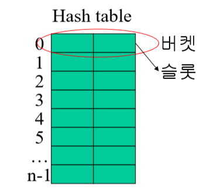
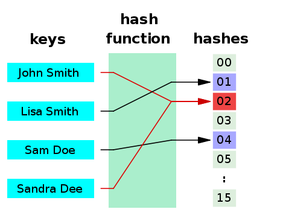

# 해시(Hash)

- Key와 Value를 갖는 자료구조
- 효율적인 검색을 위해 사용
  - 메모리 공간을 좀 더 사용해 시간을 축소시킴
  - 일반적으로 조회시 O(1)의 시간복잡도를 기대할 수 있음
- Python의 Dictionary같은 자료구조

- 키 값을 해시함수를 통해 버킷의 주소값(해시값)으로 변환하여 자료위치 파악

## 해쉬함수(Hash Function)

- 임의의 길이의 데이터를 고정길이의 데이터로 매핑하는 함수
- 해쉬함수의 결과값을 해시값이라고 함

- 해쉬함수는 해시테이블의 공간 전체에 고르게 저장할 수 있어야 함
- 충돌이 많이 발생할수록 저장, 조회시간이 증가
- 계산이 간단해야한다.

### 해쉬함수 종류

1. Division 
   - key값을 특정숫자(주로 버킷의 크기에 가까운 소수)로 나눈 나머지를 해시값으로 사용
2. 제곱함수
   - key값을 제곱하여 나온 값 중 몇개의 숫자를 선택해 해시값으로 사용
3. Folding
   - key값을 나누고 접어서 더한 숫자를 해시값으로 사용
4. Radix변환
   - key값을 다른 진법으로 변환하여 해시값으로 사용
5. Random Method
   - 난수생성 함수를 통해 나온 난수를 해시값으로 사용

## 해쉬테이블(Hash Table)

- 레코드를 한 개 이상 보관할 수 있는 버킷(bucket)으로 구성된 기억공간
- 각 버킷은 몇 개의 슬롯으로 구성

## 해시충돌(Hash Collision)

- 서로 다른 키를 가진 레코드들이 하나의 버킷에 매핑되는 경우

## 해시충돌 해결방법

### 1. 체이닝(Chaining)

- 저장소에 충돌이 일어나면 기존 값과 새로운 값을 연결리스트로 연결하는 방법
- 개방주소법에 비해 복잡한 계산식을 사용할 필요가 적음
- 해시테이블이 채워질수록, 조회시 성능저하가 덜 발생한다.
- C, Java

### 2. 개방 주소법(Open Addressing)

- 해시 충돌이 일어나면 다른 버킷에 데이터를 삽입하는 방식

- 선형 탐색(Linear Probing)
  - 해시충돌 시 다음 버킷, 혹은 몇 개를 건너뛰어 데이터 삽입
  - 특정부분에 데이터가 몰리는 클러스터링 현상발생
    - 데이터가 많을 경우 효율성 급감
  - Python의 Dictionary
- 제곱 탐색(Quadratic Probing)
  - 해시충돌 시 제곱만큼 건너뛴 버킷에 데이터 삽입 (1, 4, 9, 16 ...)
- 이중 해시(Double Hashing)
  - 해시충돌 시 다른 해시함수를 한번 더 적용한 결과를 이용

- 지정한 메모리 외 추가적인 공간이 필요하지 않음 
  - 전체 버킷이상으로 데이터를 저장할 수 없기 때문에, 로드팩터가 일정수준 이상인 경우 테이블 새로 생성(리해싱)
- 삽입, 삭제시 오버헤드가 적다.
- 저장할 데이터가 적을 때 더 유리

#### 로드 팩터(Load Factor)

`Load Factor`= `n` / `k`

`n`: 해시 테이블에 저장된 데이터의 개수

`k`: 해시 테이블의 총 칸(버킷) 개수

- 로드 팩터가 증가할수록 해시테이블의 성능은 감소
- 언어에 따라 로드 팩터 기준을 정해두고, 기준을 넘을 경우 해시 테이블을 수정

# Reference

>  https://fierycoding.tistory.com/68

> https://galid1.tistory.com/171

