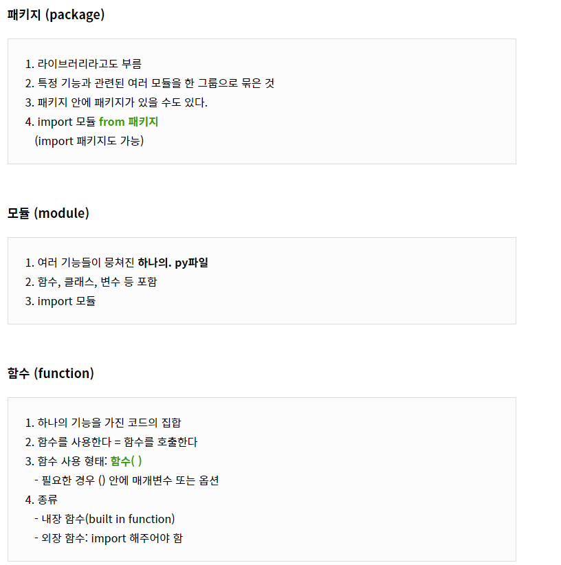

# 결합도(Coupling) 와 응집도(Cohesion)


## Before Start

- 정보처리기사 필기시험에서 **결합도(Coupling)**과 **응집도(Cohesion)**의 **순서**에 관한 문제가 빈출하기 때문에 한번 개념을 잡고 가자!

- 결합도와 응집도에 대해서 이야기 하려면 먼저 **모듈(Module)**과 **모듈화(Modularization)**에 대해서 간단히 알아볼 필요가 있다.
- 모듈화에 대한 평가를 할때 결합도와 응집도를 기준으로 평가한다.


## Module & Modularization

- 모듈(Module) & 모듈화(Modularization)
  - 부품 & 부품화
  - 보다 작고 이해할 수 있는 단위로 나누어진 것
  - **모듈화란** 소프트웨어를 각 기능별로 나누는 것을 말한다. 그리고 각각의 기능별로 나눠진 모듈화의 결과를 **모듈(Module)**이라고 하며 서브루틴(Subroutine), 소프트웨어 내의 프로그램 또는 작업 단위 등의 의미로 사용된다.

- Computer

  

- Programing

  - 모듈화 전

    main.html

    ```html
    <!DOCTYPE html>
    
    <html>
    
    <head>
        <meta charset="utf-8"/>
    </head>
    
    <body>
        <script>
            function welcome(){
                return 'Hello world'
            }
            alert(welcome());
        </script>
    </body>
    
    </html>
    ```

    

  - 모듈화 후

    greeting.js

    ```html
    function welcome(){
    	return 'Hello world';
    }
    ```

    main.html

    ```html
    <!DOCTYPE html>
    
    <html>
    
    <head>
        <meta charset="utf-8"/>
        <script src="greeting.js"></script>
    </head>
    
    <body>
        <script>
            alert(welcome());
        </script>
    </body>
    
    </html>
    ```


- **Pakage > Module > Class, Function**

  - 관계도

  





- **Why**

  - 모듈화는 프로그램의 효율적인 관리 및 성능 향상이 가능하다.
  - 소프트웨어 이해의 용이성 증대와 복잡성이 감소한다.
  - 기능의 분리가 가능하고 인터페이스가 단순해진다.
  - 모듈의 재사용 가능으로 개발과 유지보수가 용이하다.

  =>  **수정 / 재사용성 / 유지보수가 용이해진다.** + **가독성이 좋아진다.**

  

  => 유지보수가 좋다 ? 독립성이 높다

  

  => 독립성이 높은 모듈이 좋은 모듈

  

  => 즉 모듈화를 할때 모듈의 독립성을 높여야한다.

  

  => 모듈의 독립성은 어떻게 판단하는데 ?

  

  => 결합도와 응집도로 판단!

  

  => **결합**은 **다른 모듈**과 얼마나 연결되어 있는지! / **응집**은 하나의 **모듈 내부 구성요소간**에 얼마나 밀접한가!

  

  => 우리가 일반적으로 생각하는 독립 이란 ? 
  
  - 밖으로는 거리를 두고 안으로는 끈끈한
  
  
  
  => 즉! 낮은 결합도와 높은 응집도를 가진 모듈일수록 독립성이 높아진다!


## 결합도(Coupling)

- 결합도는 서로 다른 모듈 간에 상호 의존하는 정도 또는 연관된 관계를 의미한다.

- 낮을수록 좋다!

- 결합도 높은 순서대로 암기하는 두음선생 조선생

  **내**게 **공**/**부**하라고 하지 마세요 **제**가 **스**트레스 받**자**나요

​		**내**용 결합도 > **공**통 결합도 > 외**부** 결합도 > **제**어 결합도 > **스**탬프 결합도 > **자**료 결합도

​		❗높은 순서대로니까 안좋은 순서 대로 입니다.


### 자료 결합도(Data Coupling)

**가장 낮은 결합도를 갖는다. 가장 좋은 형태다.** 모듈끼리 단순히 파라미터 등을 통해 데이터를 주고받는 경우다.

여기서 주고받는 데이터는 모듈의 기능 수행에 있어서 로직을 제어하거나 하지 않는 순수한 자료형 요소이다. 또한 한 모듈을 변경하더라도 다른 모듈에는 영향을 끼치지 않는 결합 상태이다.

=> 단순 값을 전달한다.


```java
public void Bill() {
	int Money = Cal(5);
}

/**
 * 단순 데이터를 전달한다.
 */
public int Cal(int x) {
	return 500*x;
}
```


### 스탬프 결합도(Stamp Coupling)

두 모듈이 동일한 자료 구조를 참조하는 형태의 결합도이다.

즉, 모듈 간의 인터페이스로 배열 또는 오브젝트 등이 전달되는 경우를 말한다.

 자료 구조의 형태가 변경되면 그것을 참조하는 모든 모듈에 영향을 주며 변경되는 필드를 실제로 참조하지 않는 모듈에도 영향을 준다.


```java
public void foo() {
	// 번호판과 차종, 시간을 생성자로 초기화한다.
    Car c = new Car("81하 1234", "소나타", 5);
	Cal(c);
}

public void Cal(Car car) {
	// 주차요금 계산 로직
}
```


### 제어 결합도(Control Coupling)

어떤 모듈이 다른 모듈 내부의 논리적인 흐름을 제어하는 요소를 전달하는 경우를 말한다.

예를 들면, 파라미터로 전달되는 값에 따라서 모듈 내부 로직의 처리가 달라지는 Flag 값 등으로 결합되는 형태다.


```java
public void foo() {
    parkingCharge(true);	
}

public void parkingCharge(boolean isMember) {
    if (isMember) {
    	parkingMemberCharge();
    } else {
	    parkingNormalCharge();
    }
}
```


### 외부 결합도(External Coupling)

모듈이 외부에 있는 다른 모듈 또는 데이터를 참조할 때의 결합 형태를 말한다.


외부 결합도는 모듈이 외부의 데이터, 통신 프로토콜 등을 공유할 때 발생한다.

데이터를 참조 또는 공유하는 결합 형태가 이어서 살펴볼 **공통 결합**과 비슷하기 때문에 외부 결합도에 대한 설명이 생략되는 경우도 있지만

다른 점은 참조하는 데이터가 **외부**에 위치하는 것이다.

극단적인 예시는 크롤링


### 공통 결합도(Common Coupling)

여러 모듈이 하나의 데이터 영역을 참조하여 사용하는 형태다.

전역 변수(global variable)를 예로 들 수 있다. 전역 변수의 변경이 여러 모듈에 영향을 끼칠 수 있다.


```java
class LottoBalls {
    public static final int LOTTO_BALL_NUMBER = 7;
}

class AutomaticLottoBall {
    public getAutomaticLottoBall {
        // LottoBalls의 LOTTO_BALL_NUMBER 사용
    }
}

class MnualLottoBall {
    public getManualLottoBall {
        // LottoBalls의 LOTTO_BALL_NUMBER 사용
    }
}
```


### 내용 결합도(Content Coupling)

**가장 높은 결합도를 갖는다. 가장 좋지 않은 결합 형태다.** 

어떤 모듈이 사용하려는 다른 모듈의 내부 기능과 데이터를 직접 참조하는 경우다.

다른 모듈의 로컬 데이터에 접근하는 경우처럼 사용하고자 하는 모듈의 내용(코드)을 알고 있어야 한다.

모듈이 변경이 발생하는 경우 이를 참조하는 모듈의 변경이 반드시 필요하게 되므로 가장 좋지 않은 결합이다.


## 응집도(Cohesion)

- 응집도는 한 모듈 내부의 처리 요소들이 서로 관련되어 있는 정도를 말한다.

- 높을수록 좋다!

- 응집도 높은 순서대로 암기하는 두음선생 조선생

  **기순통절 시논우**

  기능적 응집도 > 순차적 응집도 > 통신적 응집도 > 절차적 응집도 > 일시적 응집도 > 논리적 응집도 > 우연적 응집도

  ❗높은 순서대로니까 좋은 순서 대로 입니다.


### 기능적 응집도(Functional Cohesion)

**응집도가 가장 높으며, 가장 좋은 형태이다.** 모듈 내의 모든 요소들이 하나의 기능을 수행하기 위해 구성된 경우를 말한다.

예를 들면, 코사인(cosine)과 같은 삼각함수를 계산하는 기능을 모아둔 함수 등이다.


### 순차적 응집도(Sequential Cohesion)

한 요소의 출력이 다른 요소의 입력으로 사용되는 형태이다. 

어떤 모듈이 특정 파일을 읽고 처리하는 기능을 하는 등과 같다. 코드로 예제를 살펴보면 아래와 같은 형태다.

```java
public void someMethod() {
    String content = readFile();
    writeFile(content);
}
```


### 통신적 응집도(Communicational Cohesion)

모든 요소들이 동일한 입력 또는 출력 데이터를 사용하여 서로 다른 기능을 수행하는 경우다.

앞서 살펴본 순차적 응집도와 다르게 처리 순서가 중요하지 않다.


### 절차적 응집도(Procedural Cohesion)

모듈내에서 여러 개의 기능 요소가 순차적으로 수행되지만 다음 기능 요소로 데이터가 아닌 흐름 제어 요소가 전달되는 경우

예를 들면, 파일을 읽을 때 접근 허가를 확인한 후에 파일을 읽는 형태 등이다.


### 일시적 응집도(Temporal Cohesion)

각 기능 요소들이 순서에 상관없이 특정 시점에 반드시 수행되는 경우다.

예를 들면, 프로그램이 구동될 때 초기화 시키는 모듈이나 예외 상황이 발생했을 때 오류 로그를 개발자에게 전송하는 기능 등 순서에 상관없는 경우를 말한다.


### 논리적 응집도(Logical Cohesion)

유사한 성격을 갖거나 특정 형태로 분류되는 처리 요소들로 모듈을 구성하며 논리적으로 비슷한 기능을 수행하지만 서로의 관계는 밀접하지 않은 형태다.

코드를 예제로 들면 다음과 같다.

```java
public void someMethod(int val) {
	switch (val) {
        case 0:
	        // do something
        	break;
        case 1:
        	// do something
        	break;
        default:
        	break;
	}	
}
```


### 우연적 응집도(Coincidental Cohesion)

**가장 좋지 않은 응집도다.** 모듈 내부의 각 구성 요소들이 아무런 관련 없이 구성된 형태다. 

앞서 살펴본 논리적 응집도와 비슷하지만, 유사한 성격이나 형태가 없으며 모듈 수정이 사이드 이펙트를 발생시킬 가능성이 매우 높다.


사이드 이펙트 : *함수가 일관된 결과를 보장하지 못하거나, 함수 외부 어디든지 조금이라도 영향을 주는 경우 모두 사이드 이펙트를 갖는 것이라 할 수 있다.*


## 당신은 집중해서 들었나요 ?


### Question1

소프트웨어의 결합도와 응집도에 대해서 소프트웨어 설계시 가장 바람직한 것은?


1. 응집도는 높게 결합도는 낮게 설계한다.
2. 응집도는 낮게 결합도는 높게 설계한다.
3. 양쪽 모두 낮게 설계한다.
4. 양쪽 모두 높게 설계한다.


### Question2

모듈사이의 결합은 강한 정도에서 약한 정도에 이르기까지 나열할 수 있다. 다음 보기 중 강한 정도에서 약한 정도순으로 가장 적절하게 나열된 것은?

1. 내용결합도 - 공통 - 제어 - 스탬프 - 자료
2. 내용결합도 - 제어 - 공통 - 스탬프 - 자료
3. 내용결합도 - 공통 - 스탬프 - 제어 - 자료
4. 내용결합도 - 제어 - 스탬프 - 공통 - 자료


### Question3

다음중에서 소프트웨어 설계시 결합도와 응집도  측면에서  가장 바람직한 항목으로 묶여진 것은 어느 것인가 ?


1. 내용 결합 + 순차적 응집
2. 스탬프 결합 + 교환적 응집
3. 자료 결합 + 기능적 응집
4. 제어 결합 + 시간적 응집

