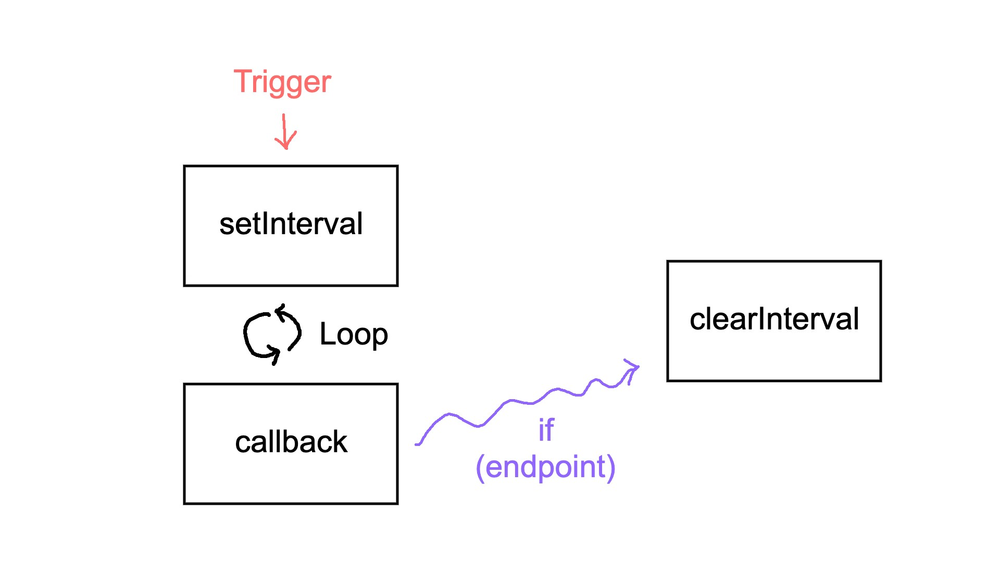

## 웹 애니메이션 최적화

프론트엔드 개발자라면 자바스크립트를 통해 웹 브라우저의 애니메이션을 구현한 경험이 있을 것이다. 그리고 종종 연속적인 이벤트를 처리하는 경우 메모리의 낭비가 발생하는 경우를 목격하곤 한다. 예로 스크롤 이벤트 리스너를 살펴보면,

이런 상황을 마주하게 된다.  당신은 이 이벤트 핸들러를 최적화 하고 싶은 생각이 들 것이다. 이렇게 잦은 호출이 일어나는 핸들러에서 side effect 를 발생시킨다면 브라우저의 성능은 크게 저하될 수 있기 때문이다. 이러한 지금부터 그 방법에 대해서 알아보도록 하자.

### 1. debounce, throttle 기법을 활용한 애니메이션

debounce 와 throttle 은 프로그래밍 기법으로 첫 째로 debounce 의 경우 여러번 발생한 event 를 하나의 단위로 묶고, 단위 이벤트 호출이 종료되었을 때 첫 번째 혹은 마지막 이벤트를 처리하는 방법이다. 이로 인해 브라우저는 이벤트로 인한 리랜더링을 한 번만 수행하면 된다. 다음으로 throttle 은 이전 event 를 처리하는 과정에서 다음 이벤트의 처리를 막는 방법이다. 병목현상을 생각하면 쉽다. 이로 인해 불필요한 이벤트의 처리를 줄일 수 있다.

### 2. setInterval 을 사용한 애니메이션

브라우저 내장함수 setInterval 을 통한 연속적인 이벤트 처리이다. 트리거를 통해 setInterval 을 등록하고, side effect를 발생시킬 callback을 호출한다. endpoint 에 도달하는 경우 clearInterval 을 통해 루프를 제거한다. 이 방식은 가장 흔하게 사용되고 있는 방법이다. setInterval 의 인자로 delay, time을 지정해주어 애니메이션 시간과 fps 를 지정할 수 있다. 만일 setInterval 반복 시간을 지정하지 않는 경우 무한 반복이 되니 callback 에서 종료를 시켜주어야 한다.

### 3. requestAnimationFrame(rAF) 을 사용한 애니메이션

requestAnimationFrame(rAF) 은 애니메이션 처리를 위한 브라우저 내장 함수이다. 이름과 같이 화면 프레임마다 callback 을 호출하여 이벤트를 처리한다. setInterval 과의 차이점은 재귀 형식으로 반드시 callback 함수에서 재귀 호출이 필요하며 delay 를 위한 인자를 받지 않는다. rAF 는 앞서 언급한 바와 같이 애니메이션을 위한 내장 함수로 부드러운 애니메이션 처리를 위해 사용하기 적합하다. 또한, 비동기 callback 함수의 호출 최적화를 위해 throttle 을 적용하는 방법도 있다.

### 결론

|        |
| ------------------------------------------------------------ |
| 순서대로 setInterval, rAF(이동거리가 다른 것은 callback 호출 횟수의 차이 때문) |

 상술한 바와 같이 브라우저 상의 애니메이션 처리를 위한 여러 가지 방법들이 있다. 각자의 상황에 맞게 사용하면 되지만 개인적으로 rAF 의 사용을 권장한다. setInterval 의 경우 애니메이션을 위한 함수가 아니다보니 불필요한 호출이 발생하거나 애니메이션이 매끄럽지 않은 문제점이 존재한다고 알려져있다. 위 이미지처럼 애니메이션 부드러움의 정도의 차이가 있다.  또, delay 를 사용자 화면에 맞추어 처리할 수 있는 능력의 차이 또한 존재하므로 rAF 를 사용해 애니메이션, 이벤트 처리를 하는 것을 연구하는 것이 좋겠다.

### 출처

[🔗 requestAnimationFrame 활용 (상)](https://velog.io/@younghwanjoe/requestAnimationFrame%EC%9D%84-%EC%82%AC%EC%9A%A9%ED%95%98%EC%97%AC-%EC%95%A0%EB%8B%88%EB%A9%94%EC%9D%B4%EC%85%98-%EA%B5%AC%ED%98%84%ED%95%98%EA%B8%B0-%EC%83%81)

[🔗 Debounce란 뭘까요?](https://medium.com/@feanar/debounce%EB%9E%80-%EB%AD%98%EA%B9%8C%EC%9A%94-82204c8b953f)

[🔗 [React] scroll 이벤트 throttle로 최적화 시키기](https://mengkki.netlify.app/React/2021-01-13-scroll%20optimization/)