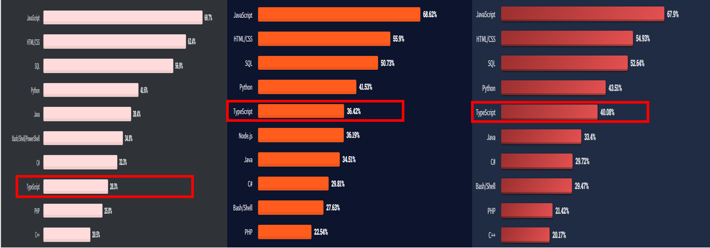
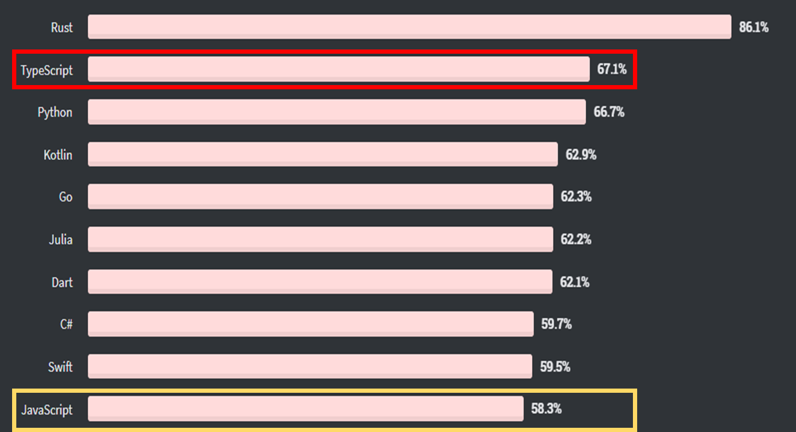
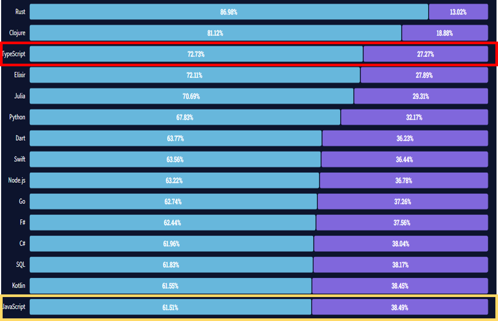
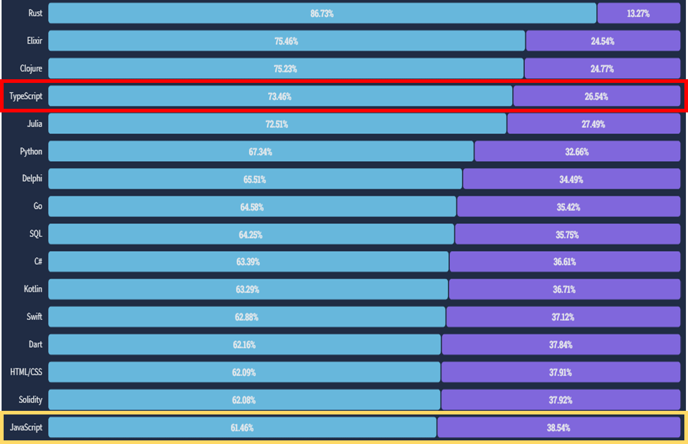

# TypeScript


## Trend

[2022.08.16 기준]


## StackOverFlow Survey 2020 ~ 2022


**Most popular technologies**




**Most loved,dreaded**

**2020** (2 vs 10)




**2021** (3 vs 15)




**2022** (4 vs 16)




## TypeScript

두 정수값을 더해주는 함수가 만들고 싶어졌다.

```javascript
function sum(a, b) {
  return a + b;
}
```

위 함수는 2개의 숫자 타입을 인수로 전달 받아 그 합계를 반환하려고 하는 함수겠지 ?

근데 다른 사람이 봤을 땐 어떤 타입의 인수를 전달해야하는지 잘 모르겠다?

그래서 혹시 다른 사람이 이렇게 호출한다면??


```javascript
sum('x', 'y'); // 'xy'
```

javascript에서는 아무 문제 없이 위의 코드를 실행하지!!!!

하지만 내가 만든 sum 함수는 이렇게 쓰라고 만든게 아니라고 문자가 들어오면 에러를 반환해야지.....


그러면 타입스크립트(정적타입)을 이용해 보자.


```typescript
function sum(a: number, b: number) {
  return a + b;
}
```

이렇게 만들면 우선 다른 사람이 보기에도 숫자를 넣어야한다는 걸 알겠다 ???

=> 가독성 up,  개발자의 의도 파악 용이


그런데도 이렇게 호출한다면??

```javascript
sum('x', 'y');
// error TS2345: Argument of type '"x"' is not assignable to parameter of type 'number'.
```

이렇게 error로 알려준다!

=> 디버깅 쉬워지지!!!


타입스크립트(TypeScript)는 자바스크립트의 **슈퍼셋**인 오픈소스 프로그래밍 언어이다.

📌 **슈퍼셋** : 컴퓨터 과학에서 슈퍼셋이란 특정한 언어의 모든 기능을 포함하면서, 다른 기능까지 포함하도록 향상 또는 확장된 것을 의미

2012년 마이크로소프트가 발표한 타입스크립트(TypeScript)는 자바스크립트(JavaScript)를 기반으로 정적 타입 문법을 추가한 프로그래밍 언어입니다.

요즘은 대형 SI 프로젝트에서 흔하게 사용되고 있으며 개발자 구인 시 우대사항 기술로도 자주 언급되고 있습니다.


### 타입스크립트의 특징


##### **컴파일 언어, 정적 타입 언어**

자바스크립트는 동적 타입의 인터프리터 언어로 런타임에서 오류를 발견할 수 있습니다.

이에 반해 타입스크립트는 정적 타입의 컴파일 언어이며 타입스크립트 컴파일러 또는 바벨(Babel)을 통해 자바스크립트 코드로 변환됩니다.

코드 작성 단계에서 타입을 체크해 오류를 확인할 수 있고 미리 타입을 결정하기 때문에 실행 속도가 매우 빠르다는 장점이 있습니다.

하지만 코드 작성 시 매번 타입을 결정해야 하기 때문에 번거롭고 코드량이 증가하며 컴파일 시간이 오래 걸린다는 단점이 있습니다.


정적 타입 vs 동적 타입

##### 정적타입 언어 (java, c, c#, c++ .....typescript)

타입(자료형)을 컴파일 시에 결정하는 것입니다.

컴파일 시에 자료형에 맞지 않은 값이 들어있으면 컴파일 에러가 발생합니다.

```c
int num = 1; // 컴파일 성공
float num2 = 1.03; // 컴파일 성공
bool num3 = 1; // 컴파일 에러
```

장점:

컴파일 시에 타입에 대한 정보를 결정하기 때문에 속도 up

타입 에러로 인한 문제점을 초기에 발견할 수 있어 타입의 안정성 up


##### 동적타입 언어(python,ruby......javascript)

타입(자료형)을 컴파일 시에 정하는 것이 아니고 실행 시(런타임)시에 결정하는 것 입니다.

```python
num1 = 10;
name = "Evan Hwang"
```

장점:

runtime 까지 타입에 대한 결정을 끌고 갈 수 있기 때문에 많은 선택의 여지가 있습니다.

단점:

인터프리터 언어는 배우기 쉬우나 실행 도중에 변수에 예상치 못한 타입이 들어와 TypeError가 생길 가능성이 있습니다.


##### **자바스크립트 슈퍼셋**

타입스크립트는 자바스크립트의 슈퍼셋, 즉 자바스크립트 기본 문법에 타입스크립트의 문법을 추가한 언어입니다.

따라서 유효한 자바스크립트로 작성한 코드는 확장자를 .js에서 .ts로 변경하고 타입스크립트로 컴파일해 변환할 수 있습니다.


##### **객체 지향 프로그래밍 지원**

타입스크립트는 ES6(ECMAScript 6)에서 새롭게 사용된 문법을 포함하고 있으며 클래스, 인터페이스, 상속, 모듈 등과 같은 객체 지향 프로그래밍 패턴을 제공합니다.


TypeScript는 ES5의 Superset이므로 기존의 자바스크립트(ES5) 문법을 그대로 사용할 수 있다. 또한, ES6의 새로운 기능들을 사용하기 위해 Babel과 같은 별도 트랜스파일러(Transpiler)를 사용하지 않아도 ES6의 새로운 기능을 기존의 자바스크립트 엔진(현재의 브라우저 또는 Node.js)에서 실행할 수 있다.

이후 [ECMAScript의 업그레이드에 따른 새로운 기능을 지속적으로 추가할 예정](https://github.com/Microsoft/TypeScript/wiki/Roadmap)이여서 매년 업그레이드될 ECMAScript의 표준을 따라갈 수 있는 좋은 수단이 될 것이다.


### 타입스크립트 사용을 고려해야 하는 이유


##### 높은 수준의 코드 탐색과 디버깅

타입스크립트는 코드에 목적을 명시하고 목적에 맞지 않는 타입의 변수나 함수들에서 에러를 발생시켜 버그를 사전에 제거합니다.

또한 코드 자동완성이나 실행 전 피드백을 제공하여 작업과 동시에 디버깅이 가능해 생산성을 높일 수 있습니다.

실제로 한 연구에 따르면 모든 자바스크립트 버그의 15%가 사전에 타입스크립트로 감지할 수 있다고 합니다.


##### 자바스크립트 호환

타입스크립트는 자바스크립트와 100% 호환됩니다. 따라서 프론트엔드 또는 백엔드 어디든 자바스크립트를 사용할 수 있는 곳이라면 타입스크립트도 쓸 수 있습니다.

타입스크립트는 앱과 웹을 구현하는 자바스크립트와 동일한 용도로 사용 가능하며 서버 단에서 개발이 이루어지는 복잡한 대형 프로젝트에서도 빛을 발합니다.


##### 강력한 생태계

타입스크립트는 그리 오래되지 않은 언어임에도 불구하고 강력한 생태계를 가지고 있습니다.

대부분의 라이브러리들이 타입스크립트를 지원하며 마이크로소프트의 비주얼 스튜디오 코드(VSCode)를 비롯해 각종 에디터가 타입스크립트 관련 기능과 플러그인을 지원합니다.


##### 점진적 전환 기능

기존의 자바스크립트 프로젝트를 타입스크립트로 전환하는데 부담이 있다면 추가 기능이나 특정 기능에만 타입스크립트를 도입함으로써 프로젝트를 점진적으로 전환할 수 있습니다.

자바스크립트에 주석을 추가하는 것에서부터 시작해 시간이 지남에 따라 코드베이스가 완전이 바뀌도록 준비 기간을 가질 수 있습니다.


##### 단점???

- 새로운 프로그래밍 언어에 대한 러닝 커브(Learning Curve)
- 상대적으로 낮은 가독성
- 코드량 증가 등의 이유


프로젝트의 규모가 크고 복잡할수록, 유지보수가 중요한 장기 프로젝트일수록 타입스트립트의 이점이 부각


### 프론트엔드 프레임워크와 타입스크립트


#### 리액트(React)

리액트와 타입스크립트의 호환성은 비교적 좋은 편입니다.

최근 들어 많은 개발자들이 리액트와 타입스크립트 조합을 선택하고 있습니다.

리액트 공식 홈페이지에서는 타입스크립트를 사용하기 위한 가이드를 제시하고 있습니다.

페이스북에서 공식적으로 배포하는 리액트 웹 개발용 보일러 플레이트(Boilerplate, 구조·설정 작업을 자동으로 진행해주는 도구이자 명령어)인 Create React App은 간단한 옵션 추가만으로 타입스크립트를 사용할 수 있도록 지원합니다.


#### 뷰(Vue.js)

뷰 2.0에서는 타입스크립트를 사용할 수 있지만 몇몇 라이브러리의 도움을 받아야 하거나 구현 자체가 안 되는 문제도 다수 있었습니다.

다행스럽게도 최근 릴리즈된 뷰 3.0부터는 타입스크립트를 공식 지원합니다.

뷰 3.0 CLI(Command Line Interface)는 타입스크립트 도구화 지원을 기본으로 제공합니다.


#### 앵귤러(Angular)

자바스크립트 기반인 앵귤러 버전 1과 달리 버전 2부터는 타입스크립트 기반으로 만들어졌고 타입스크립트를 권장하고 있습니다.


### 기본 문법

타입스크립트는 다양한 기본 타입을 제공합니다.
Boolean, Number, String, Object, Array, Tuple, Enum, Any, Void, Null, Undefined, Never

- 변수에 타입 설정

  ```typescript
  let str: string = 'hi';
  let num: number = 100;
  
  let arr: Array = [1, 2, 3];
  let arr2: number[] = [1, 2, 3];
  
  let obj: object = {};
  let obj2: { name: string, age: number} = {
   name: 'hoho',
   age: 22
  };
  ```

  

- 함수에 타입 설정

  ```typescript
  function add(a: number, b: number): number {
  return a+b;
  }
  //옵셔널 파라미터
  function log(a: string, b?: string, c?: string) {
   console.log(a);
  }
  ```

  

javascript에 존재하지 않는 타입

- Tuple : 배열의 타입 순서와 배열 길이를 지정할 수 있는 타입입니다.

  ```typescript
  var arr: [string, number] = ['aa', 100];
  ```

  

- Enum: Number 또는 String 값 집합에 고정된 이름을 부여할 수 있는 타입입니다. 값의 종류가 일정한 범위로 정해져 있는 경우에 유용합니다.

  기본적으로 0부터 시작하며 값은 1씩 증가합니다.


- Any: 모든 데이터 타입을 허용합니다.
- Void: 변수에는 undefined와 null만 할당하고 함수에는 리턴 값을 설정할 수 없는 타입입니다.
- Never: 특정 값이 절대 발생할 수 없을 때 사용합니다.


### 인터페이스

인터페이스는 타입을 정의한 규칙을 의미합니다.

타입스크립트의 인터페이스는 항상 특정 형식을 준수하는 데이터만 받겠다는 상호간의 약속을 의미한다.

```typescript
interface User {
  age: number;
  name: string;
}

// 변수에 인터페이스 활용
var ian: User = {
  age: 28,
  name: '이안'
}

// 함수에 인터페이스 활용
function getUser(user: User) {
  console.log(user);
}
const person = {
  age: 28,
  name: 'ian'
}
getUser(person);
```

- 인덱싱

```typescript
interface StringArray {
 [index: number]: string;
}

var arr2: StringArray = ['a', 'b', 'c'];
arr[0] = 10 //Error;
arr[0]; // 'a'

interface ReadonlyStringArray {
  readonly [index: number]: string;
}

const arr: ReadonlyStringArray = ['Thor', 'Hulk'];
arr[2] = 'Capt'; // Error!
```


- 딕셔너리 패턴

```typescript
interface StringRegexDictionary {
 [key: string]: RegExp // RegExp: 정규 표현식
}

var obj: StringRegexDictionary = {
 cssFile: /\.css$/,
 jsFile: 'a' //Error
}

obj['cssFile'] = /\.css$/;
obj['jsFile'] = 'a' //Error
```


- 인터페이스 확장

```typescript
// 인터페이스 확장
interface Person {
  name: string;
  age: number;
}

interface Developer extends Person {
  //name: string;
  //age: number;
  language: string;
}

var ian: Developer = {
  language: 'ts',
  name: '이안',
  age: 28
}
```


- 제네릭

  제네릭이란 타입을 마치 함수의 파라미터처럼 사용하는 것을 의미합니다.

  제네릭 함수는 여러 데이타 타입을 갖는 함수를 각각 정의하는 대신 하나의 제네릭 함수를 사용하면서 타입 파라미터로 어떤 데이타 타입을 갖는지를 표시하는 함수이다.

  

  

  먼저 다음과 같은 여러 데이타 타입을 갖는 함수들이 있다고 가정해 보자.

```typescript
function displayNumbers(data: number[]): void {
    for (const elem of data) {
        console.log(elem);
    }
}
 
function displayStrings(data: string[]): void {
    for (const elem of data) {
        console.log(elem);
    }
}
 
function displayBooleans(data: boolean[]): void {
    for (const elem of data) {
        console.log(elem);
    }
}
```


이들 함수에서 차이점은 입력 데이타 타입뿐이고, 나머지 코드는 모두 공통적으로 사용할 수 있다.

=> 이러한 경우에 제네릭을 사용하여 아래와 같이 하나의 제네릭 함수를 정의할 수 있다.


```typescript
function display<T>(data: T[]): void {
    console.log(data.length);
    for (const elem of data) {
        console.log(elem);
    }
}
 
display<number>([1, 2, 3]);
display<string>(["Tom", "Tim", "Matt"]);
display<boolean>([true, false]);    
 
// 타입체킹 오류: 
// Type 'string' is not assignable to type 'number'
display<number>([1, "2", 3]);  
```

여기서 <T> 는 타입 파라미터 (type parameter)라고 불리우는 것으로 제네릭을 사용할 때 외부에서 정의하는 타입을 의미한다. 

즉, 이 타입 파라미터에 number를 정의하면 위의 displayNumbers() 함수와 같은 기능을 하는 것이고,

string을 정의하면 displayStrings()와 같은 기능을 하는 것이다.


- 오퍼레이터

  - union type (or)

  ```typescript
  function logText(text: string | number) {
    // ...
  }
  ```
  
  위 함수의 파라미터 `text`에는 문자열 타입이나 숫자 타입이 모두 올 수 있습니다. 이처럼 `|` 연산자를 이용하여 타입을 여러 개 연결하는 방식을 유니온 타입 정의 방식이라고 부릅니다.
  
  
  
  - intersection type (and)
  
    인터섹션 타입(Intersection Type)은 여러 타입을 모두 만족하는 하나의 타입을 의미합니다. 아래 코드를 보겠습니다.
  
  ```typescript
  interface Person {
    name: string;
    age: number;
  }
  interface Developer {
    name: string;
    skill: number;
  }
  type Capt = Person & Developer;
  ```
  
  위 코드는 `Person` 인터페이스의 타입 정의와 `Developer` 인터페이스의 타입 정의를 `&` 연산자를 이용하여 합친 후 `Capt` 이라는 타입에 할당한 코드입니다. 결과적으로 `Capt`의 타입은 아래와 같이 정의됩니다.
  
  ```
  {
    name: string;
    age: number;
    skill: string;
  }
  ```
  
  


name 타입 다르면 어떻게 될까요 ???


