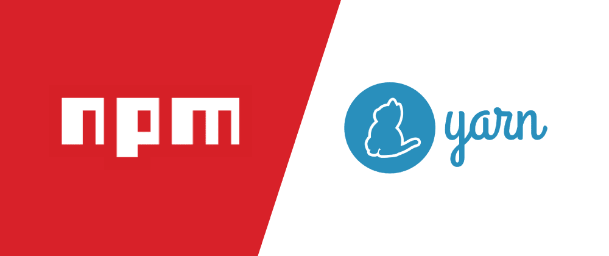

주 참고 사이트 

```
https://www.daleseo.com/js-package-manager/
```

# npm VS yarn




## npm & yarn

- 무엇인가?

  npm과 yarn은 자바스크립트 런타임 환경인 **노드(Node.js)의 패키지 관리자**입니다.

  전 세계의 개발자들이 자바스크립트로 만든 다양한 패키지를 [npm 온라인 데이터베이스 (opens new window)](https://www.npmjs.com/)에 올리면 npm, yarn과 같은 패키지 관리자를 통해 설치 및 삭제가 가능합니다. 

  그리고 명령 줄 인터페이스(Command-line interface, CLI)를 통해 패키지 설치 및 삭제뿐 아니라 패키지 버전 관리, 의존성 관리도 편리하게 할 수 있습니다. npm과 yarn의 정확한 차이는 무엇일까요? 우리는 어떤 툴을 사용해서 패키지 관리를 해야 할까요?


## NPM : https://www.npmjs.com/


- **WHAT**


    - **Node Package Manager** 혹은 Node Package Module 의 줄임말


    - Node Package Manager(혹은 Node Package Module)의 줄임말로써 Python의 pip나 Ruby의 gem처럼 Node.js의 패키지를 관리할 수 있는 도구이다.
    
      또한 npm을 사용하여 패키지를 공유하는 온라인 패키지 저장소의 이름이기도 하다.
    
    - npm은 node_modules라는 폴더에 라이브러리를 내려 받아서 저장한다.
    
      package.json 이라는 파일에 설치된 라이브러리의 정보를 적는다.
    
    - 2018년 Microsoft에 인수된 GitHub가 2020년 3월 16일에 인수.


- **HOW**

  - node.js를 설치하면 내장(built in) 되어있다.

    다음 명령어로 버전이나 설치 여부 확인 가능

    ```javascript
    npm -v 
    ```

  - pakage.json 관리

    생성

    ```javascript
    npm init
    ```

  - pakage.json

    ```javascript
    {
      "name": "application-study",
      "version": "1.0.0",
      "description": "",
      "main": "index.js",
      "dependencies": {
        "http-server": "0.9.0",
        "rimraf": "2.6.1",
        "webpack": "2.2.1",
        "worker-loader": "0.8.0"
      },
      "scripts": {
        "prebuild": "rimraf dist",
        "build": "webpack --config webpack/webpack.config.js",
        "http-server": "http-server -c-1"
      },
      "repository": {
        "type": "git",
        "url": "git+https://github.com/aaa/bbb.git"
      },
      "author": "",
      "license": "ISC",
      "bugs": {
        "url": "https://github.com/aaa/bbb/issues"
      },
      "homepage": "https://github.com/aaa/bbb#readme"
    }
    ```

여기서 중요한 부분은 "scripts" 와 "dependencies" 입니다.

script는 우리가 run 명령어를 통해서 실행할 것들을 적어두는 것이고 dependencies의 경우는 설치할 모듈들을 의미합니다.

 npm install -g webpack 같이 설치를 해서 자동으로 기록할 수 있습니다. 

## YARN : https://yarnpkg.com/


- **WHAT**

  - yarn은 2016년 페이스북에서 개발한 패키지 관리자입니다.

    리액트(React)와 같은 프로젝트를 진행하며 겪었던 어려움을 해결하기 위해 개발되었고

     npm 레지스트리와 호환하면서 속도나 안정성 측면에서 npm보다 향상되었습니다.

​				[2016년 페이스북이 공개한 아티클](https://engineering.fb.com/2016/10/11/web/yarn-a-new-package-manager-for-javascript/)

- **HOW**

  - yarn은 npm을 통해서 설치

    ```javascript
    npm install yarn --global
    ```

  - for Mac (by brew)

    ```javascript
    brew update
    brew install yarn
    ```

  - 패키지 저번 잠금을 위해서 npm은 `package-lock.json`을 yarn은 `yarn.lock`을 사용

## 차이점

### 속도

npm과 yarn의 주요 차이점 중 하나는 패키지 설치 프로세스를 처리하는 방법입니다. npm은 패키지를 한 번에 하나씩 순차적으로 설치합니다.

그에 비해 yarn은 여러 패키지를 동시에 가져오고 설치하도록 최적화되어 있어 패키지 설치 속도 측면에서 yarn이 npm보다 빠릅니다.


### 보안

yarn은 보안 측면에서 npm보다 더 안전한 것으로 알려져 있습니다. npm은 자동으로 패키지에 포함된 다른 패키지 코드를 실행합니다.

이로 인해 보안 시스템에 몇 가지 취약성이 발생하며 나중에 심각한 문제가 발생할 수 있습니다.

반면에 yarn은 yarn.lock 또는 package.json파일에 있는 파일만을 설치합니다. 보안은 yarn의 핵심 기능 중 하나이지만 최근 npm의 업데이트에서 npm의 보안 업데이트도 크게 향상되었습니다.


### 명령어

|       명령어       |                 npm                 |             yarn              |
| :----------------: | :---------------------------------: | :---------------------------: |
| dependencies 설치  |             npm install             |             yarn              |
|    패키지 설치     |       npm install [패키지명]        |      yarn add [패키지명]      |
|  dev 패키지 설치   |  npm install --save-dev [패키지명]  |   yarn add --dev [패키지명]   |
| 글로벌 패키지 설치 |   npm install --global [패키지명]   |  yarn global add [패키지명]   |
|    패키지 제거     |      npm uninstall [패키지명]       |    yarn remove [패키지명]     |
|  dev 패키지 제거   | npm uninstall --save-dev [패키지명] |    yarn remove [패키지명]     |
| 글로벌 패키지 제거 |  npm uninstall --global [패키지명]  | yarn global remove [패키지명] |
|      업데이트      |             npm update              |         yarn upgrade          |
|  패키지 업데이트   |        npm update [패키지명]        |    yarn upgrade [패키지명]    |


### 무엇을 사용할까 ?

### 성능

 초창기에는 npm을 압도하는 성능으로 인기를 끌었는데

 2020년 현재는 npm이 개선을 거듭하여 설치 및 링크 퍼포먼스 측면에서 npm과 yarn은 큰 차이가 없다고 한다.


### 현황 및 미래가치

Yarn은 현재 Yarn 2가 삐꺽거리면서 상당히 과도기적인 시점에 있으며 Yarn 1은 공식적으로 더 이상 기능 추가를 하지 않겠다고 발표되었습니다.

 반면에 npm은 최근 Github에 인수되었고 그 뒤에는 Microsoft가 있으니 지금처럼 앞으로도 지속적인 업데이트가 될 것으로 예상해볼 수 있습니다.


## Others

### PNPM : https://pnpm.io/ko/

- 빠른 성능과 디스크 절약을 처음부터 끝까지 강조하고 있는 패키지 관리자.

  모듈형 라이브러리 및 프레임워크에서 적극적으로 사용하고 있는 추세이며, yarn 처럼 npm 을 pnpm 으로 마이그레이션이 쉽게 지원된다.
  yarn 의 경우 2 버전부터 워크스페이스를 지원한 반면, pnpm 은 정식 버전 출시 전부터 워크스페이스를 지원한다.

  이 pnpm의 장점이자 단점이 될 수 있는 양날의 검이 바로 불필요하거나 중복된 패키지 미설치를 통한 디스크 용량 절약인데, 라이브러리나 프레임워크처럼 배포형태를 염두에 둔다면 좋은 선택이지만, 프로젝트를 생각한다면, 종속성이 사용하는 모듈을 프로젝트에서 기본적으로 사용할 수 없다.

  이는 npm 에서는 있을 수 없는 일이며, yarn 의 경우 2 버전부터 나타날 수 있는 특징이다.

  이를 해결하려면 종속성을 직접 명시하여 설치하는 게 가장 최선이지만, 일부 모듈의 경우 모듈의 종속성을 설치 없이 사용하는 경우가 있어서 이로 인한 라이브러리 누락 오류로 인해 빌드가 실패하는 경우가 있다. 

  이런 이슈에 대해서는 모듈 개발자가 해결해주지 않는 이상 해결이 불가능하여, pnpm 및 yarn 2 이상 대신 npm 이나 yarn 을 이용해야 하는 경우도 있다.


### Yarn Berry: 논란의 시작

이렇게 npm과 Yarn으로 양분된 자바스크립트 패키지 시장에서 작년에 재미있는 일이 일어납니다. 바로 Facebook에서 오픈 소스로 독립한 Yarn이 Yarn Berry라고도 불리는 Yarn의 두 번째 버전을 발표하게 됩니다. 여기서 문제는 Yarn 2는 좋게 말하면 혁신, 나쁘게 말하면 Yarn 1과 호환을 포기했다고 봐도 좋을 정도로 크게 변했다는 점입니다.

소위 Plug’n’Play라고 불리는 이 새로운 패키지 관리 방식은 프로젝트의 `node_modules` 디렉토리에 패키지를 저장하지 않는다는 점에서 기존 패키지 매니저와 큰 차별점을 두었는데요. 이 방식은 성능 상의 이점에도 불구하고 자바스크립트 커뮤니티에서 호불호가 강해서 많은 프로젝트에서 Yarn 2로 넘어가는 것을 꺼리고 있는 상황입니다. 처음에 Yarn을 만든 Facebook의 개발팀에서도 Yarn 2를 공개적으로 비판을 하였으니 앞으로도 당분간 논란은 계속될 것으로 보입니다.

Yarn 2(Yarn Berry)에 대해서 좀 더 자세히 알고 싶으신 분들은 아래 사이트를 참고 바랍니다.

- Github 저장소: https://github.com/yarnpkg/berry
- 공식 문서 사이트: https://yarnpkg.com/


## 패키지 잠금 파일 (pakage-lock.json & yarn.lock)


### 패키지 관리 매커니즘

패키지 잠금을 이해하려면 먼저 패키지 매니저가 프로젝트가 의존하는 패키지를 어떻게 관리해주는지 이해하는 것이 좋습니다.

패키지 관리를 위해 `npm`을 사용하든 `yarn`을 사용하든 해당 프로젝트의 메타 정보는 `package.json` 파일을 통해 관리가 됩니다. 이 `package.json` 파일에는 해당 프로젝트가 의존하고 있는 모든 패키지 이름과 버전이 나열되어 있는데요. 일반적으로 설치되어야 하는지 패키지들은 `dependencies` 항목에, 그리고 개발할 때만 필요한 패키지들은 `devDependencies` 항목에 명시됩니다.

예를 들어, `react`와 `react-dom` 패키지에 의존하는 프로젝트의 `package.json` 파일의 모습은 대략 다음과 같을 것입니다.

- package.json

```json
{
  "name": "my-project",
  "version": "1.0.0",
  "dependencies": {
    "react": "^16.8.2",
    "react-dom": "^16.8.2"
  }
}
```

이렇게 설치가 필요한 패키지들이 `package.json` 파일에 등록이 되어 있으면, 프로젝트의 모든 개발자는 패키지 매니저의 설치 커맨드 하나로 모든 패키지를 한번에 설치할 수 있습니다. 아래와 같이 프로젝트에서 사용하고 있는 패키지 매니저에 따라 설치 커맨드를 날리면 `package.json` 파일에 등록되어 있는 모든 패키지가 npm registry로 부터 다운받아져 `node_modules` 디렉터리에 저장됩니다.

- npm

```bash
$ npm i
또는
$ npm install
```

- yarn

```bash
$ yarn
또는
$ yarn install
```

참고로, 설치가 끝나고 `node_modules` 디렉터리 내부에 들어가보면, `react`와 `react-dom` 패키지 외에도 생소한 패키지들을 볼 수 있으실 것입니다. 이러한 패키지들은 해당 프로젝트가 직접적으로 필요하지는 않지만, `react`와 `react-dom` 패키지가 필요로하기 때문에 간접적으로 의존하게 된 패키지입니다.

```bash
$ ls node_modules
js-tokens     loose-envify  object-assign prop-types    react         react-dom     react-is      scheduler
```

이렇게 `package.json` 파일만 있으면 해당 프로젝트가 의존하고 있는 모든 패키지를 설치할 수 있기 때문에, `node_modules` 디렉터리는 Git 저장소에 올라가지 않도록 보통 `.gitignore` 파일에 추가합니다.


### 설치 시점에 따라 달라지는 패키지 버전

그렇다면 `package.json` 파일만 있으면 프로젝트의 모든 개발자가 패키지 매니저를 이용해서 항상 동일한 버전의 패키지를 설치할 수 있을까요? 안타깝게도 모든 개발자가 정확히 같은 시각 동시에 패키지를 설치하지 않는 이상 개발자들은 서로 상이한 버전의 패키지를 설치할 확률이 발생하게 됩니다. 가장 큰 이유는 `package.json` 파일에 등록된 패키지의 버전이 `^`나 `~` 등을 이용해서 범위로 지정된 경우가 많기 때문인데요.

예를 들어, 위 예제와 같이 `react` 패키지가 `"react": "^16.8.2"`이라고 등록되어 있으면, SemVer 규칙에 따라 `16.8.2` 이상 `17.0.0` 미만의 범위로 버전이 지정됩니다. 맨 처음 프로젝트에 `react` 패키지를 설치한 개발자 A가 특정 버전을 지정하지 않았다고 가정하면, 당시 `react` 패키지의 최신 버전은 `16.8.2` 였을 것입니다. 만약에 추후 개발자 B가 `npm i`나 `yarn` 명령어를 통해 모든 패키지를 설치할 당시 `react` 패키지의 최신 버전이 `16.8.3`이였다면 개발자 B의 PC에는 `16.8.3`이 설치되어 있을 것입니다. 마찬가지로 프로젝트에 몇달 후에 합류한 개발자 C가 `react` 패키지의 최신 버전이 `16.9.1`일 때 같은 방법으로 모든 패키지를 설치했다면, 개발자 C의 PC에는 `16.9.1`이 설치되었을 것입니다. 게다가 프로젝트의 CI 서버는 배포할 때마다 매번 모든 패키지를 설치한다고 가정하면, 애플리케이션이 배포되는 서버에는 항상 그 당시 최신 버전의 `react` 패키지가 설치되어 사용될 것입니다.

- package.json: `^16.8.2`
- 개발자 A의 PC: `16.8.2`
- 개발자 B의 PC: `16.8.3`
- 개발자 C의 PC: `16.9.1`
- 개발/상용 서버: `16.10.0`

이렇게 서로 다른 버전의 패키지를 설치해서 사용하는 개발자 간에 큰 혼선이 발생할 수 있습니다. (ex. 개발자 A의 PC에서 성공하는 테스트가, 개발자 B의 PC에서는 실패, 개발자 C의 PC에서만 특정 버그 발생) 또한, 실제 서버에 배포된 애플리케이션이 개발자 컴퓨터에서 돌아가는 애플리케이션과 100% 동일하게 작동한다는 보장이 없어지게 되어 디버깅시 매우 난감한 상황에 빠질 수 있습니다. 이러한 상황은 패키지 매니저에서 패키지 잠금이 지원되지 않던 시절에 매우 골칫거리였던 문제이며, `yarn`에서 패키지 잠금을 지원하고, 추후 `npm`에서도 패키지 잠금을 지원하게 된 이유이기도 합니다.


### 패키지 잠금

이렇게 동일한 `package.json` 파일을 사용해도 시간과 장소에 따라서 서로 다른 버전의 패키지가 설치되는 문제는 패키지 잠금을 통해 해결할 수 있습니다. `yarn`이나 비교적 최근에 릴리즈된 `npm`을 사용해서 프로젝트에 새로운 패키지를 설치하면 `package.json` 파일에 해당 패키지가 등록될 뿐만 아니라 패키지 잠금 파일이 생성되는 것을 보실 수 있으실 겁니다. `package-lock.json`이나 `yarn.lock`과 같은 패키지 잠금 파일에는 프로젝트에 패키지에 최초로 추가될 당시에 정확히 어떤 버전이 설치가 되었는지를 기록됩니다.

예를 들어, 예제 프로젝트에서 `npm i`를 실행하면 프로젝트 최상위 디렉터리에 다음과 같이 `package-lock.json` 파일이 생깁니다.

- package-lock.json

```json
{
  "name": "my-project",
  "version": "1.0.0",
  "lockfileVersion": 1,
  "requires": true,
  "dependencies": {
    "react": {
      "version": "16.11.0",
      "resolved": "https://registry.npmjs.org/react/-/react-16.11.0.tgz",
      "integrity": "sha512-M5Y8yITaLmU0ynd0r1Yvfq98Rmll6q8AxaEe88c8e7LxO8fZ2cNgmFt0aGAS9wzf1Ao32NKXtCl+/tVVtkxq6g==",
      "requires": {
        "loose-envify": "^1.1.0",
        "object-assign": "^4.1.1",
        "prop-types": "^15.6.2"
      }
    },
    "loose-envify": { ... 생략 ... },
    "object-assign": { ... 생략 ... },
    "prop-types": { ... 생략 ... }
  }
}
```

`react` 패키지 부분을 보면 현재 이 글을 쓰고 있는 당시 `react`의 최신 버전인 `16.11.0`이 설치된 것을 알 수 있습니다. 이렇게 한 번 `package-lock.json` 파일이 생성되면, 그 이후로는 `npm i` 커맨드를 실행했을 때, npm registry에 등록된 최신 버전을 설치하지 않습니다. 대신에, 항상 `package-lock.json` 파일에 명시되어 있는 버전으로 패키지를 설치를 해주기 때문에, 설치 시점에 상관없이 항상 동일한 버전의 패키지가 설치되는 것을 보장받을 수 있습니다.

자, 이제 제가 이 `package-lock.json` 파일을 프로젝트의 Git 저장소에 올려두면, 다른 개발자들은 `package.json` 파일 뿐만 아니라 `package-lock.json` 파일까지 내려받게 될 것입니다. 그러면 앞으로 프로젝트의 모든 개발자의 PC뿐만 아니라 애플리케이션이 배포되는 서버까지도, npm registry에 배포된 최신 버전을 무시하고 `package-lock.json`에 기록된 버전 기준으로 패키지가 설치될 것입니다.


### 주의사항

1. 프로젝트를 최초 Set-up 하는 개발자는 반드시 패키지 잠금 파일을 Git 저장소에 올린다.
2. 이후 이뤄지는 패키지 갱신/삭제는 자동으로 `pakage.json` 와 `pakage-lock.json`을 동기를 맞춰주기 때문에 수정해야 할 필요도 해서도 안된다.
3. 마지막으로 기존 패키지를 갱신/제거한 개발자는 두 파일 모두 커밋해야한다.
