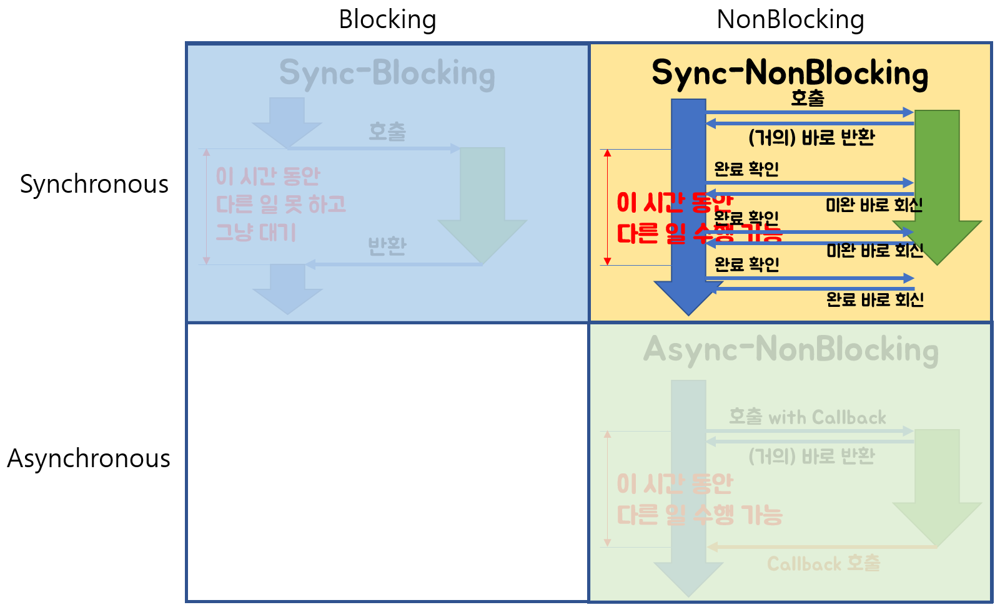

# 동기 vs 비동기 & 블럭 vs 논블럭


- ##### 참고링크

  ```
  https://velog.io/@daybreak/%EB%8F%99%EA%B8%B0-%EB%B9%84%EB%8F%99%EA%B8%B0-%EC%B2%98%EB%A6%AC
  
  https://day0404.tistory.com/33
  
  https://hamait.tistory.com/930 **
  
  https://velog.io/@nittre/%EB%B8%94%EB%A1%9C%ED%82%B9-Vs.-%EB%85%BC%EB%B8%94%EB%A1%9C%ED%82%B9-%EB%8F%99%EA%B8%B0-Vs.-%EB%B9%84%EB%8F%99%EA%B8%B0
  
  https://velog.io/@wonhee010/%EB%8F%99%EA%B8%B0vs%EB%B9%84%EB%8F%99%EA%B8%B0-feat.-blocking-vs-non-blocking
  
  https://velog.io/@ongsim123/CS7-%EC%B9%B4%ED%8E%98-%EC%A3%BC%EB%AC%B8-%EC%9D%B4%EB%B2%A4%ED%8A%B8
  ```
  
  

## 사전지식

- 제어권
  - 제어권은 자신(함수)의 코드를 실행할 권리 같은 것이다. 제어권을 가진 함수는 자신의 코드를 끝까지 실행한 후, 자신을 호출한 함수에게 돌려준다.
- ###### 결과값을 기다린다는 것
  
  - A 함수에서 B 함수를 호출했을 때, A 함수가 B 함수의 결과값을 기다리느냐의 여부를 의미한다.


## 동기 VS 비동기

- 개념

  동기와 비동기의 차이는 **호출되는 함수의 작업 완료 여부를 신경쓰는지의 여부**의 차이이다.

  


* 동기 (synchronous : 동시에 일어나는)

  함수 A가 함수 B를 호출한 뒤, **함수 B의 리턴값을 계속 확인하면서 신경쓰는 것**이 동기이다.

  ```
   - 동기는 말 그대로 동시에 일어난다는 뜻입니다. 요청과 그 결과가 동시에 일어난다는 약속인데요. 바로 요청을 하면 시간이 얼마가 걸리던지 요청한 자리에서 결과가 주어져야 합니다.
   
  - Thread1이 작업을 시작 시키고, Task1이 끝날때까지 기다렸다 Task2를 시작한다.
  - 작업 요청을 했을 때 요청의 결과값(return)을 직접 받는 것이다.
  - 요청의 결과값이 return값과 동일하다.
  - 호출한 함수가 작업 완료를 신경 쓴다.
  ```

​		


* 비동기 (Asynchronous : 동시에 일어나지 않는)

  함수 A가 함수 B를 호출할 때 **콜백 함수를 함께 전달**해서, 함수 B의 작업이 완료되면 함께 보낸 콜백 함수를 실행한다.

  함수 A는 함수 B를 호출한 후로 **함수 B의 작업 완료 여부에는 신경쓰지 않는다.**

  ```
   - 비동기는 동시에 일어나지 않는다를 의미합니다. 요청과 결과가 동시에 일어나지 않을거라는 약속입니다. 
  
  - Thread1이 작업을 시작 시키고, 완료를 기다리지 않고, Thread1은 다른 일을 처리할 수 있다.
  - 작업 요청을 했을 때 요청의 결과값(return)을 간접적으로 받는 것이다.
  - 요청의 결과값이 return값과 다를 수 있다.
  - 해당 요청 작업은 별도의 스레드에서 실행하게 된다.
  - 콜백을 통한 처리가 비동기 처리라고 할 수 있다.
  - 호출된 함수(callback 함수)가 작업 완료를 신경 쓴다.
  ```

​	

- 장단점

  - 동기

    ```
     동기방식은 설계가 매우 간단하고 직관적이지만 결과가 주어질 때까지 아무것도 못하고 대기해야 하는 단점이 있다.
    ```

  - 비동기

    ```
     비동기방식은 동기보다 복잡하지만 결과가 주어지는데 시간이 걸리더라도 그 시간 동안 다른 작업을 할 수 있으므로 자원을 효율적으로 사용할 수 있는 장점이 있습니다.
    ```


## Blocking Vs Non-blocking

- 개념

  블로킹과 논블로킹은 A 함수가 B 함수를 호출했을 때, **제어권을 어떻게 처리하느냐에 따라 달라진다.**

- **Blocking**

  

- **Non-blocking**

  

  ## 조합

  

### Sync-Blocking


​	

```
함수 A는 함수 B의 리턴값을 필요로 한다(동기). 그래서 제어권을 함수 B에게 넘겨주고, 함수 B가 실행을 완료하여 리턴값과 제어권을 돌려줄때까지 기다린다(블로킹).
```

```
우체국에 배달 트럭들이 줄을 서 있다. 우체국에 들어오는 물품들을 싣기 위해서인데, 
- 1번 트럭이 우체국에 내 것들을 가져와주세요 요청하고 기다린다. (블럭)
- 우체국은 1번 트럭에게 주기 위한 물건들을 찾아서 싣기 시작한다. 
- 2번트럭은 1번트럭에 물건이 다 싣기를 기다린다. (블럭)
- 3번 트럭도 기다린다. (블럭)
- 1번트럭이 물건을 싣고 떠나면, 우체국은 이제 2번 트럭의 물건을 찾아서 싣는다. (동기) 모든 일들이 순차적으로 일어 난다 (동기)
```

```
나 : 대표님, 개발자 좀 더 뽑아주세요..

대표님 : 오케이, 잠깐만 거기 계세요!

나 : …?!!

대표님 : (채용 공고 등록.. 지원자 연락.. 면접 진행.. 연봉 협상..)

나 : (과정 지켜봄.. 궁금함.. 어차피 내 일 하러는 못 가고 계속 서 있음)
```


### Async-NonBlocking


```
비동기 논블로킹은 이해하기 쉽다. A 함수는 B 함수를 호출한다.

이 때 제어권을 B 함수에 주지 않고, 자신이 계속 가지고 있는다(논블로킹). 따라서 B 함수를 호출한 이후에도 멈추지 않고 자신의 코드를 계속 실행한다.

그리고 B 함수를 호출할 때 콜백함수를 함께 준다. B 함수는 자신의 작업이 끝나면 A 함수가 준 콜백 함수를 실행한다(비동기).
```

```
우체국에 가서 내가 필요한 물품은 무엇이라고 접수원에게 말을 하고 트럭을 놓고 집에 온다. (논블럭)
트럭(버퍼) 크기가 크다면 우체국에서 많이 채워 줄 것이다. (하지만 좀 더 시간이 걸리겠지) 
- 우체국은 물품을 준비하고, 나는 집에 와서 내일 을 한다 (비동기)
- 전화 따위는 하지 않는다. 우체국에서 알아서 트럭에 짐을 채워서 나에게 트럭이 준비됬으면 연락 할 것이기 때문이다.
- 트럭이 가득 찼다고 연락이 왔다. 나는 트럭을 가지고서 배달을 시작하고 우체국은 자신의 일을 한다.
이것이 논블럭/비동기이다.
완전 효율적이지 않는가? 하지만 이것도 병목지점이 있다. 어디일까? 그렇다. 이 배달기사는 트럭이 한대 뿐이다. 트럭이 한대 뿐이기 때문에, 배달하는 동안에는 우체국에서 또 다른 짐을 싣지 못한다.어떻게 해결 할까? 간단하다. 트럭을 2개 만드는 것이다 (기술적으로 버퍼를 2개)그러면 한대는 배달하는 동안에 우체국에 다른 한대를 맡겨 놓는 것이다.이렇게 되면 배달일 끝날 쯤에는 우체국에 가있는 트럭은 가득 차 있을 것이고, 나는 연속적으로 배달을 할 수 있어서 돈을 많이 벌 수 있을 것이다.
여기서 끝이 아니다 병목이 또 하나 있다. 이번엔 무엇인가?그렇다 배달기사가 하나라는 것이다. 우체국에서 또 다른 트럭이 벌써 가득 차 있다고 연락이 왔지만, 배달중이라 그것을 처리 할 수가 없다. 이때 어떻게 해야하나? 그렇다 배달알바를 구하면 된다. 한대의 트럭이 준비되면 그 트럭이 짐을 3등분해서 배달알바 3명에게 나눠준다. 또 다른 트럭이 준비되면 , 배달알바가 끝난 알바생에게 나눠주거나 또 다른 알바생에게 나눠주면 된다.일의 크기에 따라서 알바생을 늘리면 되는 것이다. 
이 알바생이 소프트웨어에서 무엇일까?그렇다~~ 멀티쓰레드이다.비동기 / 싱글쓰레드로 짧게 짧게 일하는 곳 (Node 비동기 서버에서 간단한 리턴만 서비스 하는 곳)에서는 멀티 쓰레드를 굳이 도입하지 않아도 효율적이지만, 백단에서 먼가 해야 할 것이 많다면 (CPU intensive) 이렇게 멀티쓰레드를 추가 해주면 성능이 대폭 올라 갈 것이다.
출처: https://hamait.tistory.com/930 [HAMA 블로그:티스토리]
```

- 버퍼란?

  ```
  컴퓨팅에서, 버퍼(buffer, 문화어: 완충기억기)는 데이터를 한 곳에서 다른 한 곳으로 전송하는 동안 일시적으로 그 데이터를 보관하는 메모리의 영역이다.
  ```

  

- 쓰레드란?

  ```
  프로세스(process)란?
  
  프로세스란 현재 실행 중인 프로그램(program)이다.
  
  즉, 사용자가 작성한 프로그램이 운영체제의 의해 메모리 공간을 할당받아 실행 중인것을 말한다.
  
  프로세스는 프로그램에 사용되는 데이터와 메모리 등의 자원 그리고 스레드로 구성된다.
  
  
  스레드(thread)란?
  
  쓰레드란 프로세스 내에서 실제로 작업을 수행하는 주체를 의미한다.
  
  모든 프로세스에는 한 개 이상의 스레드가 존재하여 작업을 수행한다. 또한, 두 개 이상의 스레드를 가지는 프로세스를 멀티스레드 프로세스(multi-threaded process)라고 한다.
  
   
  
  멀티스레드의 장점
  
  - cpu의 사용률을 향상
  
  - 자원을 보다 효율적으로 사용할 수 있다
  
  - 사용자에 대한 응답성이 향상
  
  - 작업이 분리되어 코드가 간결해진다
  ```

  ```
  나 : 대표님, 개발자 좀 더 뽑아주세요..
  
  대표님 : 알겠습니다. 가서 볼 일 보세요.
  
  나 : 넵!
  
  대표님 : (채용 공고 등록.. 지원자 연락.. 면접 진행.. 연봉 협상..)
  
  나 : (열일중..)
  
  대표님 : 한 분 모시기로 했습니다~!
  
  나 : 😍
  ```

  

### Sync-NonBlocking




```
A 함수는 B 함수를 호출한다. 이 때 A 함수는 B 함수에게 제어권을 주지 않고, 자신의 코드를 계속 실행한다(논블로킹).

그런데 A 함수는 B 함수의 리턴값이 필요하기 때문에, 중간중간 B 함수에게 함수 실행을 완료했는지 물어본다(동기).

즉, 논블로킹인 동시에 동기인 것이다.
```

```
우체국에 가서 내가 필요한 물품은 무엇이라고 접수원에게 말을 하고 집으로 돌아온다.
- 우체국은 물품을 준비하고, 나는 전화기를 붙잡는다.
- 우체국에 전화 해서 접수원과 통화한다. 물품이 준비되었냐고 물어본다. 접수원은 안됬다고 말한다. 나는 전화를 바로 끊는다. (논블럭)  
- 전화를 끊고, 집안 청소를 하는게 아니라, 다시 우체국에 전화한다. 안됬다고 하면 바로 끊는다 (논블럭)
- 계속 반복적으로 전화한다 (논블럭이며, 나는 내 일을 하는게 아니라 우체국의 일에 매달리고 있으므로 동기) 
- 이번 전화에는 접수원이 준비됬다고 말한다. 나는 트럭을 가지고 우체국으로 가서 물건을 싣고 온다.
- 나는 싣고 온 물건을 배달한다.중간 중간 논블럭으로 전화를 바로 끊지만, 끊고 나서 바로 또 전화를 하므로 동기* 이 경우에 내가 배달하는 동안에는 현실과 좀 다르지만 우체국은 쉰다고 생각 해야한다.  (동기) 
출처: https://hamait.tistory.com/930 [HAMA 블로그:티스토리]
```

```
나 : 대표님, 개발자 좀 더 뽑아주세요..

대표님 : 알겠습니다. 가서 볼 일 보세요.

나 : 넵!

대표님 : (채용 공고 등록.. 지원자 연락.. 면접 진행.. 연봉 협상..)

나 : 채용하셨나요?

대표님 : 아직요.

나 : 채용하셨나요?

대표님 : 아직요.

나 : 채용하셨나요?

대표님 : 아직요~!!!!!!
```


### Async-Blocking


### 

```
Async-blocking의 경우는 사실 잘 마주하기 쉽지 않다.

A 함수는 B 함수의 리턴값에 신경쓰지 않고, 콜백함수를 보낸다(비동기).

그런데, B 함수의 작업에 관심없음에도 불구하고, A 함수는 B 함수에게 제어권을 넘긴다(블로킹).

따라서, A 함수는 자신과 관련 없는 B 함수의 작업이 끝날 때까지 기다려야 한다.

Async-blocking의 경우 sync-blocking과 성능의 차이가 또이또이하기 때문에 사용하는 경우는 거의 없다.

```

```
우체국에 가서 내가 필요한 물품은 무엇이라고 접수원에게 말을 하고 집으로 돌아온다.
- 우체국은 물품을 준비하고, 나는 집에서 집안 청소를 한다. (비동기)- 우체국에 전화 해서 접수원과 통화한다. 물품이 준비되었냐고 물어본다. 접수원은 준비될 때 까지 기다리라고 한다. 나는 하염없이 기다린다 (블럭)
- 접수원이 준비됬다고 말한다. 나는 트럭을 가지고 우체국으로 가서 물건을 싣고 온다.
- 우체국은 자신의 일을 하고, 나는 싣고 온 물건을 배달한다 (비동기) 중간에 블럭되는 지점이 있지만, 그 이전과 이후에는 각자 자신의 일을 한다. 
출처: https://hamait.tistory.com/930 [HAMA 블로그:티스토리]
```

```
나 : 대표님, 개발자 좀 더 뽑아주세요..

대표님 : 오케이, 잠깐만 거기 계세요!

나 : …?!!

대표님 : (채용 공고 등록.. 지원자 연락.. 면접 진행.. 연봉 협상..)

나 : (안 궁금함.. 지나가는 말로 여쭈었는데 붙잡혀버림.. 딴 생각.. 못 가고 계속 서 있음)
```


## JavaScript

자바스크립트는 단일 쓰레드, 즉 하나의 작업만 돌아간다고 볼 수 있다.

이로 인해 어떻게 비동기 작업이 가능한지 헷갈릴 수 있다.

자바스크립트 비동기 병렬 처리에 대해서 알아보자.


### 멀티쓰레드 vs 단일쓰레드

- 멀티쓰레드

  : 한 프로세스를 여러 개의 스레드로 구성하여 같이 처리하는 것

  멀티 쓰레드 개념으로 보면 비동기 병렬 처리는 자연스럽다.

- 단일쓰레드

  : 한 프로세스 당 하나의 스레드로 구성되어 일을 처리하는 것

  단일 쓰레드 개념에선, 병렬 처리라는 것 자체가 어색하다.

  자바스크립트는 단일 쓰레드 인데 어떻게 비동기 병렬 처리가 가능한 것일까? 한번 알아보도록 하자.


### JS 비동기 프로그래밍의 특징

JS는 단일 쓰레드의 단점을 회피하기 위해 비동기 프로그래밍을 사용한다.

Source를 순회하는 쓰레드는 하나이지만 Netword IO나 DB를 조회하는 등의 시간 비용이 큰 로직은

다른 쓰레드로 위임하고 또 다른 로직으로 이동해 작업을 수행한다.


이렇게 큰 일들을 다른 쓰레드로 위임하는 것이 JS 비동기의 특징이다.

위임시키는 대상은 API라는 곳인데, 브라우저엔 WebAPI , NojeJS에서는 Node API라고 부르는 별개의 쓰레드 영역이다.

그렇다면 큰 일을 던져준 JS 메인 쓰레드는 쉬는가? 그렇지 않다.

던져준 일을 콜백 함수로 처리하고 다른 일을 진행하며, 이것이 `Non-Blocking` 의 개념이다.

`Blocking`은 처리된 일을 기다리고 다음 일을 진행하는 것을 뜻할 것이다.


이런 식으로 API에게 던진 일이 끝나면, `이벤트 큐`에 등록하고 `이벤트 루프`를 통해 메인쓰레드에 알려주는 시스템이다. 이 시스템을 `이벤트 기반 아키텍쳐` 라고 부른다.

1. 처리된 일은 `Event Queue` 에 들어가 대기한다.
2. 메인 쓰레드가 일을 마쳐 CallStack에서 실행할 게 없어지면
3. `Event Loop`는 `Event Queue`에 있는 일을 하나 꺼내서 CallStack에 집어 넣어 실행한다.

이 과정이 JS에서 비동기를 처리하는 방법이며,

그 처리 방식에는 CallBack이 있고 이를 개선한 Promise와 async & await 이 있다.


### JavaScript 비동기식 처리 3가지

- Callback
- Promise
- async & await