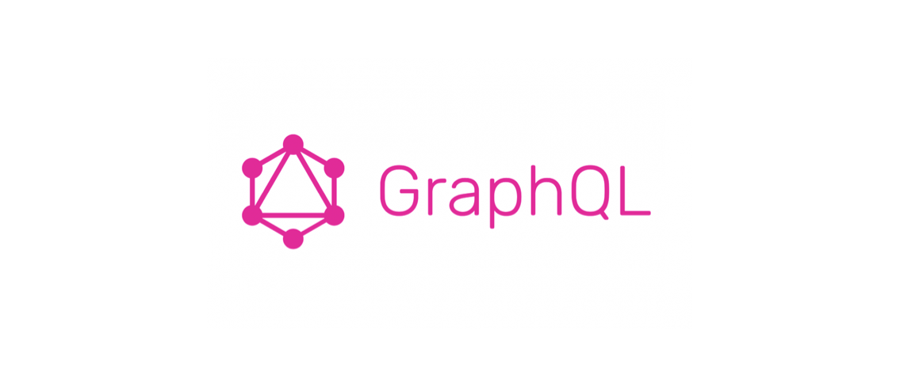

# GraphQL



## **GraphQL (Graph Query Language)**

- Server API를 구성하기 위해 Facebook이 만든 쿼리언어
    - 쿼리언어?
      
        쿼리언어는 정보를 얻기 위해 보내는 질의문(query)를 만들기 위해 사용되는 컴퓨터 언어
        
        예시) `SQL`
    
- 다양한 모바일 기기에서 기기마다 필요한 정보의 형태가 달라 기존 REST API에서는 이러한 사항을 모두 고려하기 힘들었다. ⇒ GraphQL등장


## **GraphQL vs REST**

- GraphQL API는 하나의 EndPoint를 가진다.
- GraphQL API는 요청할 떄 사용하는 쿼리에 따라 다른 응답을 받을 수 있다.

```
REST API
→ example.com/class
→ example.com/class/(반 index)
→ example.com/class/(반 index)/students
→ example.com/class/(반 index)/students/(학생 index)

GraphQL
→ example.com    (하나의 엔드포인트에 다른 쿼리를 사용해 요청)
```


### GraphQL

```json
query {
    person(personID: 1) {
        name
        height
        mass
    }
}
```

```json
{
    "data": {
        "person": {
            "name": "Luke Skywalker",
            "height": 172,
            "mass": 77
        }
    }
}
```

- GraphQL는 API test를 위한 자체적 UI제공


### REST

```
GET, https://swapi.dev/api/people/1
```

```json
{
    "name": "Luke Skywalker",
    "height": "172",
    "mass": "77",
    "hair_color": "blond",
    "skin_color": "fair",
    "eye_color": "blue",
    "birth_year": "19BBY",
    "gender": "male",
    "homeworld": "http://swapi.dev/api/planets/1/",
    "films": ["http://swapi.dev/api/films/1/", 
              "http://swapi.dev/api/films/2/", 
              "http://swapi.dev/api/films/3/", 		
              "http://swapi.dev/api/films/6/"],
    "species": [],
    "vehicles": ["http://swapi.dev/api/vehicles/14/", "http://swapi.dev/api/vehicles/30/"],
    "starships": ["http://swapi.dev/api/starships/12/", "http://swapi.dev/api/starships/22/"],
    "created": "2014-12-09T13:50:51.644000Z",
    "edited": "2014-12-20T21:17:56.891000Z",
    "url": "http://swapi.dev/api/people/1/"
}
```

- REST는 swagger같은거 해줘야댐


## GraphQL의 구조

### Operation Type

- GraphQL의 Operation Type ⇒ REST의 method대신 객체의 형태로 표현
    - query : 읽기요청 (get)
    - mutation : 수정요청(추가, 삭제 포함) (post, put, delete)
    - subscription : 주로 실시간 어플리케이션 개발에 사용


### Schema

```typescript
type Character {
  name: String!
  appearsIn: [Episode!]!
}
```

- 오브젝트 타입 : Character
- 필드 : name, appearsIn
- 스칼라 타입 : String, ID, Int 등
- 느낌표(!) : 필수 값을 의미(non-nullable)
- 대괄호([, ]) : 배열을 의미(array)


### Resolver

- GraphQL에서 데이터를 가져오는 구체적인 과정을 구현한 것
- Data Source에 무관하게 데이터를 가져올 수 있다. (DB, 일반파일, http 등)

```json
{
  paymentsByUser(userId: 10) {
    id
    amount
    user {
      name
      phoneNumber
    }
  }
}
```

```typescript
Query: {
    paymentsByUser: async (parent, { userId }, context, info) => {
        const limit = await Limit.findOne({ where: { UserId: userId } })
        const payments = await Payment.findAll({ where: { LimitId: limit.id } })
        return payments        
    },  
  },
  Payment: {
    limit: async (payment, args, context, info) => {
      return await Limit.findOne({ where: { id: payment.LimitId } })
    }
  }
```

- 첫번째 인자 parent
    - 연쇄적 리졸버 호출에서 부모 리졸버가 리턴한 객체
    - 이 객체를 활용해서 현재 리졸버가 내보낼 값을 조절
- 두번째 인자 args
    - 쿼리에서 입력으로 넣은 인자
- 세번째 인자 context
    - 모든 리졸버에게 전달
    - 주로 미들웨어를 통해 입력된 값들
    - 로그인 정보 혹은 권한과 같이 주요 컨텍스트 관련 정보
- 네번째 인자 info
    - 스키마 정보와 더불어 현재 쿼리의 특정 필드 정보
    - 잘 사용하지 않음


## GraphQL의 장단점

### **장점**

1. HTTP요청을 줄일 수 있다.
    - 여러번 요청을 보낼 필요없이 원하는 데이터를 한번에 요청할 수 있다.
    - Under-fetching
        - 하나의 데이터셋을 완성시키기 위해 여러번 요청를 보내할 떄 발생
2. HTTP응답 사이즈를 줄일 수 있다.
    - REST의 경우 response의 형태가 정해져있기 때문에 불필요한 정보까지 응답에 포함된다.
    - Over-fetching
        - 내가 필요한 정보보다 더 많은 정보를 받게 되는 것 ⇒ 리소스낭비
3. 프론트엔드와 백엔드 개발자의 부담을 덜 수 있다.
    - 기존 REST방식을 사용할 경우 정해진 형식에 맞춰야 하기 때문에 커뮤니케이션이 강제됨
    - 하나의 데이터를 추가하기 위해 회의해야 함
    - GraphQL을 사용할 경우 request/response 형식에 대한 의존도가 낮음

### **단점**

1. 고정된 요청과 응답만 필요할 때는 query로 인해 요청의 크기가 커질 수 있다.
    - REST에 비해 요청에 담아야 하는 정보가 많을 수 있다.
2. HTTP캐싱이 불가능하다.
    - GraphQL만의 방식으로 캐싱해야함
        - 영속쿼리(persisted query)
        - 아폴로엔진(Apollo Engine)
3. 파일 업로드 구현방법이 정해져있지 않아 직접 구현해야 한다.


## GraphQL의 사용을 도와주는 라이브러리

- 아폴로(Apollo GraphQL)
- 등등


## 결론

장단점을 잘 파악해 서비스에 맞는 방식을 고르자


## **Reference**

> [https://jongminfire.dev/graph-ql%EC%9D%B4%EB%9E%80](https://jongminfire.dev/graph-ql%EC%9D%B4%EB%9E%80)
> 

> [https://1eemember.tistory.com/54](https://1eemember.tistory.com/54)
> 

> [https://owin2828.github.io/devlog/2020/11/12/GraphQL-1.html](https://owin2828.github.io/devlog/2020/11/12/GraphQL-1.html)
> 

> [https://tech.kakao.com/2019/08/01/graphql-basic/](https://tech.kakao.com/2019/08/01/graphql-basic/)
> 

> [https://www.youtube.com/watch?v=1p-s99REAus&t=3s](https://www.youtube.com/watch?v=1p-s99REAus&t=3s)