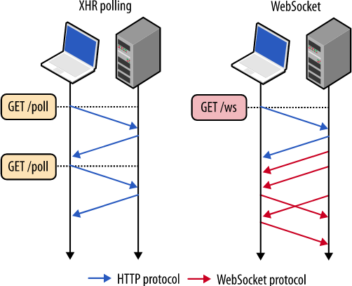

## WebSocket은 어떻게 실시간 통신을 할까?

익히 알다시피 http, https의 경우 **비연결성**의 성격을 띈다. 만약 웹에서 친구에게 메세지를 새로 받았을 때 http 연결만 지원한다면, 우리는 페이지를 새로고침해야 새로운 알림을 확인할 수 있다. 이를 해결하기 위해 **연결성**을 띄는 Socket 연결을 사용한다면 새로고침 등 http 요청 없이 실시간 알림을 받을 수 있다. 이번 시간에는 socket의 통신 구조에 대해서 한 번 알아보도록 하자.


### WebSocket의 개념



HTML5 버전부터 지원하게 된 기술로 기존 http 연결의 단점을 보완해 서버와 클라이언트 간의 **연결을 유지**한다. 위 그림과 같이 클라이언트의 요청이 있어야 응답을 하는 것과 반대로 특별한 요청이 없어도 서버는 클라이언트에게 데이터를 보낼 수 있다. 단, http 연결과는 다르게 연결을 유지하기 때문에 서버와 클라이언트 양측에 부하가 생길 수 있어 주의가 필요하다.


### WebSocket의 작동원리


1. Openning HandShake

- 서버와 클라이언트는 웹 소켓 연결 이전 HandShake를 거칩니다. HandShake는 http로 이루어 지며 이를 통해 소켓 연결이 이루어지게 됩니다.

    (request/response header)

    ```http
    GET /chat HTTP/1.1
    Host: localhost:8080
    Upgrade: websocket
    Connection: Upgrade
    Sec-WebSocket-Key: x3JJHMbDL1EzLkh9GBhXDw==
    Sec-WebSocket-Protocol: chat, superchat
    Sec-WebSocket-Version: 13
    Origin: http://localhost:9000
    출처: https://kellis.tistory.com/65 [Flying Whale:티스토리]
    ```


2. Data Transfer

- HandShake를 거쳐 웹 소켓 연결이 된 이후, 서버와 클라이언트는 메세지를 전달받으며 이 메세지는 한 개 이상의 데이터 프레임으로 구성되어있습니다.
- 또한, 연결이 유지되고 있음을 확인하기 위해 heartbeat 패킷을 보내고, 주기적으로 **ping**을 보내 연결이 유지되고 있음을 확인합니다.

​	✓ ping(Packet INternet Groper)

​	- 네트워크를 통해 상대방에게 접근 여부를 조사하기 위해 사용하는 프로그램. 즉, 상대방에게 신호를 보내고 응답을 받는 데 걸린 시간을 주로 사용한다.


3. Close HandShake

- 웹 소켓 연결을 종료하기 위한 과정입니다. 서버 혹은 클라이언트에서 연결을 종료한다는 메세지를 보내면 응답을 보내고 연결을 종료합니다.


### 대표적인 사용 예시

1. 페이스북과 같은 SNS APP
2. LOL 같은 멀티플레이어 Game
3. 위치 기반 APP
4. 증권 거래 정보 사이트 및 APP
5. 화상 채팅 APP
6. 구글 Doc 같이 여러 명이 동시 접속해서 수정할 수 있는 Tool


### 출처

[🔗 [웹소켓] WebSocket의 개념 및 사용이유, 작동원리, 문제점](https://choseongho93.tistory.com/266)

[🔗 WebSocket의 동작원리](https://kellis.tistory.com/65#:~:text=%EC%9B%B9%EC%86%8C%EC%BC%93%EC%9D%80%20HTTP%EB%A1%9C,%EC%9D%91%EB%8B%B5%EC%9D%84%20%EA%B5%AC%EB%B6%84%ED%95%98%EC%A7%80%20%EC%95%8A%EC%8A%B5%EB%8B%88%EB%8B%A4.)