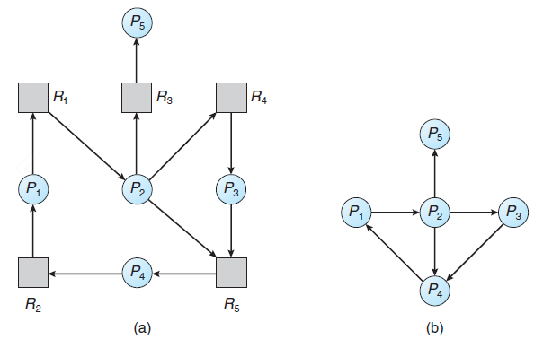

# 교착상태(DeadLock)

- 두개 이상의 프로세스나 스레드가 서로 자원을 얻지 못해서 다음 처리를 하지 못하고 무한히 다음 자원을 기다리게 되는 상태
- 시스템적으로 한정된 자원을 여러곳에서 사용하려고 할 때 발생한다.

## 교착상태가 발생하는 과정

- 각각의 Process는 Resource 1, 2가 모두 할당되어야 작업 시작
- Process 1에는 Resource 1이 할당, Process 2에는 Resource 2가 할당
- 각각의 Process는 나머지 Resource가 할당될 때까지 할당된 자원을 점유하고 무한정 대기
- 영원히 끝나지 않는 대기상태

## 교착상태가 발생하기 위한 네가지 필요조건

- 네가지 모두 성립해야 교착상태 발생

  

1. 상호 배제(mutual exclusion)
   - 자원은 한번에 한 프로세스만 사용할 수 있음
2. 점유와 대기(hold-and-wait)
   - 최소한 하나의 자원을 점유하고 있으면서 다른 프로세스에 할당되어 사용하고 있는 자원을 추가로 점유하기 위해 대기하는 프로세스가 존재해야함
3. 비선점(nopreemption)
   - 다른 프로세스에 할당된 자원은 사용이 끝날 때까지 강제로 빼앗을 수 없음
4. 순환 대기(circular-wait)
   - 프로세스의 집합에서 순환 형태로 자원을 대기하고 있어야 함

## 교착상태 해결법

- 교착상태 무시
- 교착상태 예방
- 교착상태 회피
- 교착상태 탐지 & 회복

### 교착상태 무시

- 교착상태가 드물게 발생하는 시스템에서 사용하는 방법
- Window나 Unix환경

- 교착상태의 발생빈도에 비해 교착상태를 고려하는데 필요한 비용이 상대적으로 큰 경우
- 교착상태가 발생할 경우 사용자가 직접 특정 프로세스를 종료하거나 시스템 재부팅을 통해 해결

### 교착상태 예방

- 교착상태의 발생조건중 하나를 제거하여 예방하는 방법

  => 자원낭비가 매우 심해짐

  => 잘 사용하지 않음

- 각 조건을 부정하는 방법

  - 상호 배재 부정 
    - 여러 프로세스가 공유 자원 사용
  - 점유 대기 부정
    - 프로세스 실행 전 모든 자원을 할당
  - 비선점 부정
    - 자원 점유 중인 프로세스가 다른 자원을 요구할 때 가진 자원 반납

  - 순환대기 부정
    - 자원에 고유번호 할당 후 순서대로 자원 요구

### 교착상태 회피

- 교착 상태 발생을 피해나가는 방법
- 은행원 알고리즘 등으로 회피
  - 시스템을 안전 상태 / 불안전 상태로 구분하고 불안전 상태일 땐 대기
  - 할당할 자원 수 고정, 프로세스 수 고정, 제한된 시간안에 자원 반납 등 많은 조건 필요
  - [은행원 알고리즘 참고](https://jhnyang.tistory.com/102)
- 자원을 요청할 때마다 시스템의 상태를 판단 => 오버헤드가 커짐
  - 오버헤드(overhead) : 어떤 처리를 하기위해 들어가는 간접적인 처리시간, 메모리 등

​	

### 교착상태 탐지 & 회복

- 교착 상태가 자주 발생하는 시스템에서 사용하는 방법

- 교착 상태 탐지

  - 자원할당 그래프 소거법

  

  - 탐지 알고리즘 호출 시점
    - 일정 주기 마다
    - 자원을 할당하는 순간
    - CPU이용률이 일정수준에 도달했을 때

- 교착 상태 복구
  - 순환대기 해소
  - 순환이 없어질 때까지 프로세스 종료
    - 남은 수행시간, 자원의 수 등의 우선순위에 따라 종료
  - 순환에 포함된 프로세스의 제어권을 뺏고 롤백

## Reference

> https://jhnyang.tistory.com/2
>
> https://gyoogle.dev/blog/computer-science/operating-system/DeadLock.html
>
> https://www.youtube.com/watch?v=Ry_gB34cvwc
>
> https://www.youtube.com/watch?v=FXzBRD3CPlQ
>
> https://jhnyang.tistory.com/102
>
> https://wakestand.tistory.com/253

