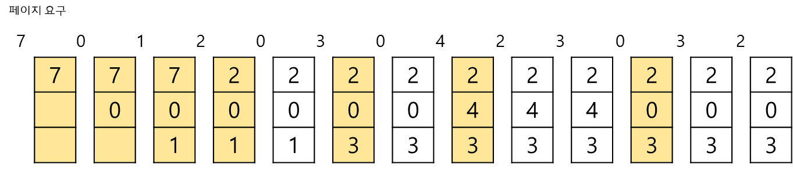
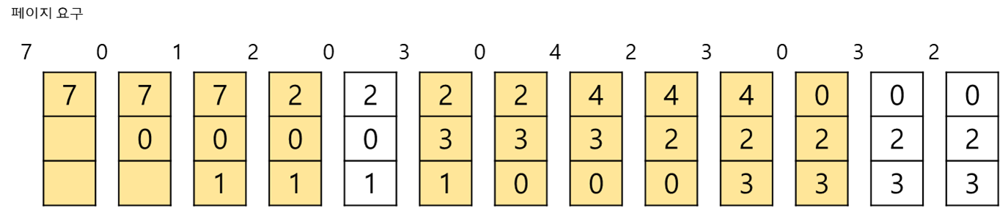
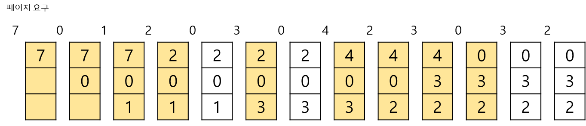
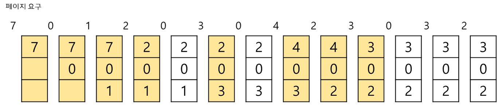
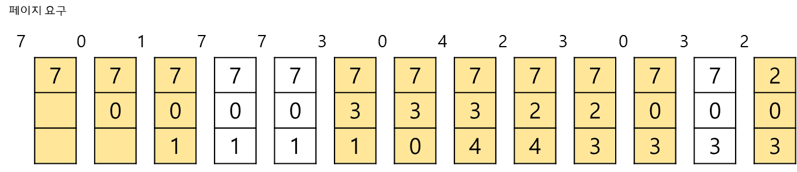
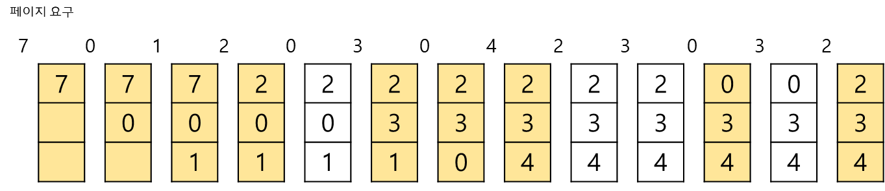

# 가상메모리 및 페이지 교체 알고리즘

[1. 가상메모리란?](#1.-가상메모리란?)

[2. 페이지 교체 알고리즘](#2.-페이지-교체-알고리즘)

## 1. 가상메모리란?

보조기억장치(HDD, SSD)의 일부를 주기억장치(RAM, Cache, register)처럼 사용하는것을 의미.

- 주 기억장치의 용량보다 큰 프로그램을 실행시키기 위해, 메모리를 가상화 해 마치 하나의 연속된 물리적 메모리 공간처럼 여길 수 있게끔 하기 위해 사용
- 애플리케이션을 실행하는 데 필요한 `최소` 메모리에 집중
- MMU (Memory Management Unit) -> 가상주소를 물리주소로 변환. 일일이 가상 주소에서 물리 주소로 변환하게 되면 작업 부하가 너무 높아지므로 RAM을 부분(페이지)으로 나누어 각 페이지를 독립된 항목으로 처리.

> `Frame` : 물리 메모리를 일정한 크기로 나눈 블록
>
> `Page` : 가상 메모리를 일정한 크기로 나눈 블록

#### 페이지 테이블 (Page Table)

#### 요구페이징 (Demand Paging)

CPU가 요청할 때 프로세스의 데이터를 메모리에 올리는 것을 의미한다. 처음부터 모든 데이터를 메모리로 적재하지는 않음.

#### 페이지 폴트 (Page Faults)

가상 메모리 공간에는 존재하지만 시스템의 RAM에는 존재하지 않는 데이터 코드에 접근을 시도할 때 발생하는 현상.

- 메인 메모리에 없어서, 이를 가상 메모리에서 메인 메모리로 적재하라는 신호
- 유효하지 않은 페이지 넘버에 접근할 때 (무시)

운영체제는 해당 데이터를 메모리로 가져와서 명령어를 재실행함으로써 페이지 폴트가 발생하지 않은 것 처럼 작동하게 해줌.

![빽 투더 기본기 [OS 8편]. 가상 메모리 관리](https://blog.kakaocdn.net/dn/3MDND/btqzkQXWwnT/HnW1LS7RrayvpvoWqjslDK/img.png)

**이때 필요한 개념이 페이지 교체 정책!** 

메모리가 꽉 차있을 때 기존 페이지 중 하나를 물리 메모리에서 내리고, 새로운 페이지를 비워진 물리 메모리 공간에 올리게 되는데, 기존에 있는 페이지 중 어떤 것을 내리면 좋을지 고민한 알고리즘이 페이지 교체 알고리즘

## 2. 페이지 교체 알고리즘

 

#### OPT (Optimal)

> 앞으로 가장 오랫동안 사용되지 않을 페이지 교체

가장 이상적

하지만 앞으로 가장 오랫동안 사용되지 않을 페이지를 알 수 없음.

 

#### FIFO (First In First Out)

> 가장 먼저 들어온 페이지 교체

메모리에 가장 먼저 올라온 페이지를 먼저 내보내는 코드, 가장 구현이 간편하다.

 

#### LRU (Least Recently Used)

> 가장 오랫동안 사용하지 않은 페이지 교체

##### Second Change Algorithm (LRU Approximation Algorithm)

기본적으로는 FIFO에 기반한 알고리즘 

reference bit을 둬 머무른 시간이 오래된 page이지만 최근에 접근되지 않은 페이지를 찾음.

 

#### LFU (Least Frequently Used)

> 참조 횟수가 가장 낮은 페이지 교체, 만약 교체 대상 페이지가 여러개일 경우 LRU 알고리즘을 따라 가장 오래 사용되지 않은 페이지로 교체

초기에 한 페이지를 집중적으로 참조하다가 참조하지 않는 경우 문제가 될 수 있다.

**ex)** 

 

#### MFU (Most Frequently Used)

> 참조 횟수가 가장 많은 페이지 교체

가장 많이 사용된 페이지가 앞으로는 사용되지 않을 것이다는 가정을 한 알고리즘

###### [참고]

>Operating System Concepts / 홍릉과학출판사
>
>https://liveyourit.tistory.com/234?category=900150
>
>https://ahnanne.tistory.com/15
>
>https://jins-dev.tistory.com/entry/%EA%B0%80%EC%83%81-%EB%A9%94%EB%AA%A8%EB%A6%ACVirtual-Memory%EC%99%80-%ED%8E%98%EC%9D%B4%EC%A7%95Paging%EC%97%90-%EB%8C%80%ED%95%9C-%EC%A0%95%EB%A6%AC
>
>https://medium.com/pocs/%ED%8E%98%EC%9D%B4%EC%A7%80-%EA%B5%90%EC%B2%B4-page-replacement-%EC%95%8C%EA%B3%A0%EB%A6%AC%EC%A6%98-650d58ae266b
>
>https://gwpaeng.tistory.com/177
