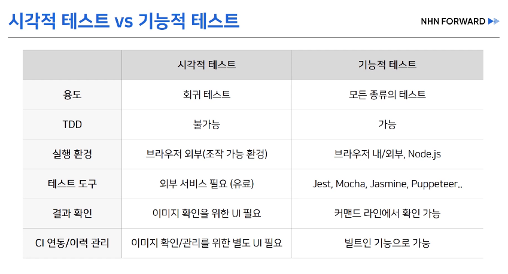
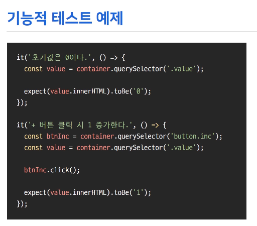
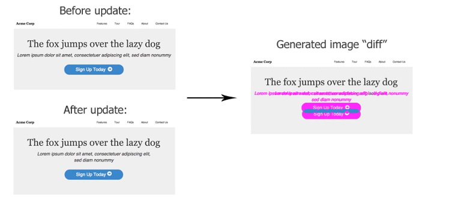

# TDD

### TDD란?

Test Driven Development 의 약자로 테스트 주도 개발을 의미

테스트코드를 먼저 작성하고, 실제 개발은 나중에 하는 개발방법

"프로그램을 작성하기 전에 테스트를 먼저 하라! (Test the program before you write it!)" - 켄트백(Kent Beck) 

#### TDD 개발주기

- red : 실패하는 테스트 코드를 먼저 작성
- green : 테스트 코드를 성공시키기 위한 실제 코드 작성
- blue : 중복코드 제거, 일반화 등의 리팩토링 수행

#### 일반 개발방식

- 기존의 개발방식은 디자인 -> 코드개발 -> 테스트로 이어지는 과정
- 개발을 느리게하는 잠재적 위험 존재
  1. 소비자의 요구사항이 처음부터 명확하지 않을 수 있다.
  2. 따라서 처음부터 완벽한 설계는 어렵다.
  3. 자체 버그 검출 능력 저하 또는 소스코드의 품질이 저하될 수 있다.
  4. 자체 테스트 비용이 증가할 수 있다.

​	=> 프로그램 초기 설계가 완벽하지 않기 때문

​	=> 작은부분의 기능수정에도 모든부분을 테스트하게 되기 때문

#### TDD

- 일반적인 개발방식과 달리 디자인 -> 테스트 코드 작성 -> 코드개발 -> 리팩토링 으로 이어짐
- 테스트 코드 작성을 통해 버그 및 수정사항을 발견하고 설계를 개선한다.
- TDD에서 테스트는 단위테스트(Unit test)를 의미

### TDD를 사용하는 이유 (장점)

- 변화에 대한 두려움을 줄여준다. -> 내 코드에 대한 자신감을 가질 수 있다.
  - 이미 테스트를 통과한 코드이기 때문에 실제 배포시에도 문제가 발생할 확률이 적음
- 테스트 커버리지가 높아진다. <- > 테스트 커버리지가 높아야 TDD가 가능하다.
  - 테스트작성 -> 모든 테스트 케이스 실패 -> 코드 작성 -> 모든 테스트 케이스 통과 -> 개발완료
- 디버깅시간을 줄여준다. 
  - 유닛테스트를 통해 현재 발생하는 문제가 어디에서 발생하는지 찾아내기 쉽다. 
- 동작하는 문서 역할을 한다.
  - 테스트 케이스를 통해 코드가 어떤 기능을 수행하는지 알기 쉽다.
- 오버엔지니어링 방지
  - 테스트를 통과하는 만큼의 코드만 작성 -> 어디까지 개발해야할지가 명확하다.
- 설계에대한 피드백이 빠르다.
  - 테스트를 작성하면서 즉각적으로 설계를 수정할 수 있으므로 

### TDD를 하기 어려운 이유 (단점)

- 생산성 저하
  - 처음부터 테스트와 개발코드 2개의 코드를 짜야한다.
  - 일반적인 개발방식에 비해 10~30% 시간이 더 걸림
  - 시간은 금이다. -> SI프로젝트에서는 잘 사용하지 않음

- 기존개발 방식과 다른 방식
  - 익숙하지 않은 방식이기 때문에 익숙해지기위한 노력이 필요하다.

## 테스트는 어떻게 하는가

### Backend에서 테스트

Backend의 경우 입력데이터(HTTP 요청) -> 출력데이터(HTTP 응답)

=> 데이터 간의 비교를 통해 테스트 가능

JUnit 등을 사용, 기능테스트

### Frontend에서 테스트

입력데이터 

- DOM 이벤트 : 마우스, 키보드, 터치 등의 입력 => 브라우저의 이벤트 시뮬레이션 API사용
- 라우팅/IO : URL 변경, 네트워크/로컬파일, 로컬스토리지/쿠키 => 브라우저 API 목킹 / E2E 테스트 도구 사용
  - 목킹(Mocking) : Mock == 모조품, 테스트하고자 코드가 의조하는 function이나 class에 대해 모조품을 만들어 일단 돌아가게 하는 것

​		

출력데이터(시각적요소)

- 코드 관점 : HTML, CSS => 생성된 HTML, CSS 코드내용 비교
- 사용자 관점 : 브라우저가 렌더링한 화면(픽셀 정보) => 브라우저가 렌더링한 화면을 캡쳐해서 이미지로 비교

시각적 테스트 vs 기능적 테스트

=> 원활한 테스트를 위해서 시각적요소와 기능적요소를 잘 분리해야 한다.

기능적 테스트 예제

- 버튼을 클릭시 숫자가 1 증가하는 카운터
- 기능적 테스트에서는 시각적요소 의존성을 제거해야 한다.

시각적 테스트 방법

- HTML 비교
  - 문자열로 비교
  - diffableHTML을 사용하면 indent나 띄어쓰기를 고려해서 비교해줌
  - HTML구조만으로는 실제 결과물을 예측하기 어렵다
- Snapshot 비교
  - jest등을 통해서 초기실행 결과값을 snapshot파일로 저장한뒤 추후 비교에 사용

- 이미지 비교
  - 시각적 회귀 테스트
  - 

# Reference

> **[A5] 프론트엔드에서 TDD가 가능하다는 것을 보여드립니다. - FEConf Korea** https://www.youtube.com/watch?v=L1dtkLeIz-M&t=152s

> **[10분 테코톡] 😼 피카의 TDD와 단위테스트 - 우아한 tech** https://www.youtube.com/watch?v=3LMmPXoGI9Q

> **테스트 코드와 TDD 🧪(feat. 프론트엔드, 백엔드를 위한 테스트 코드)** - 드림코딩 https://www.youtube.com/watch?v=Npi21gLIEZM

> **키보드에서 손 떼! 현실 세상의 TDD를 제대로 보여줄게! 프로그래머 이규원** - 페스트 캠퍼스 https://www.youtube.com/watch?v=N5WyUEwY0DY&t=1

> **[2019] 실용적인 프런트엔드 테스트 전략 - NHN Cloud** https://www.youtube.com/watch?v=q9d631Nl0_4

> https://blog.naver.com/haert2010/222693778522

> https://hanamon.kr/tdd%EB%9E%80-%ED%85%8C%EC%8A%A4%ED%8A%B8-%EC%A3%BC%EB%8F%84-%EA%B0%9C%EB%B0%9C/

> https://mangkyu.tistory.com/143