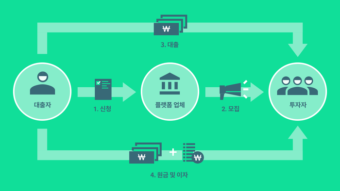

# FinTech

## What ?

 Finance(금융) + Technology(기술) = <b>FinTech(핀테크)</b> 

- **핀테크 정의**

  - 금융서비스와 디지털 혁신을 이루는 정보기술이 융합된 최근의 금융 혁신 현상을 일컬음

  - ‘핀테크’라는 용어는 “금융 서비스 산업의 새로운 응용 프로그램, 새로운 처리 과정, 신상품이나 신산업모델” 등 다양하고 넓은 의미로 사용되고 있음 (Wikipedia)

    

  - 금융(Finance)에 IT기술(Technology)을 접목하여 복잡하고 어려웠던 금융을 효율적으로 편리하게 서비스하는 것을 뜻합니다.

    10년 전부터 사용하던 온라인 뱅킹도 일종의 '핀테크'라고 할수 있습니다.

    과거의 핀테크는 금융상품 사용을 좀 더 편리하게 만드는 것에 그쳤다면 최근에는 IT기술을 통해 금융산업을 혁신하고 있는 상황입니다.

## 핀테크에는  어떤 기술이 있을까 ?

- **언번들링(Unbundling)**

  

  - 번들링(Bundling)이란 여러개를 하나로 묶는것.

    ex) Excel, Word, PowerPoint 등을 묶어서 마이크로소프트 오피스(MS Office)로 판매

  - 번들링의 반댓말로 **하나로 통합되어 있던 것을 여러개로 나누는 것** 

    ex) 은행에서는 모든 금융서비스를 다루지만, 초기 Toss(토스)에서는 간편 송금만 다루었다.

  - 앞으로는 **리번들링(rebundling) 전략**이 중심이 될거라는 예측

    리번들링이란 언번들링을 통해 특화된 서비스에 집중하여 고객을 유치한 후, 점차 다양한 서비스를 추가 제공하여 하나의 플랫폼에서 모두 제공하는 전략으로 현재 토스의 전략을 예로 들 수 있다.

- **로보어드바이저 (Robo-Advisor)**

  

  - **인공지능 프로그램이 자산운용가의 역할을 하는것.**

  - 금융사가 축적해온 데이터, 빅데이터, 자체 알고리즘을 바탕으로 투자자문을 하고, 직접 자산운용도 수행.

  - **장점**

    **1. 데이터 기반의 객관적인 추천**
    인간 자산관리사의 판단에는 주관이 개입합니다. 인간이기 때문에 실수를 한다던지, 부정을 저지를 리스크가 존재하죠. 반면 로보 어드바이저는 데이터와 알고리즘을 바탕으로 투자를 운용합니다. 그리고 투자의 경험을 머신러닝을 통해 반복적으로 학습합니다. 아직 많은 로보 어드바이저들이 완벽하지 않은 알고리즘 때문에 일부 인간의 판단을 개입시키는 경우가 많지만, 점점 더 인간의 개입은 최소화되는 추세입니다.

    **2. 시간과 장소에 구애받지 않는 편리함**
    지금까지 투자 자문을 받거나 일임하기 위해서는 증권사나 은행 지점에 직접 가서 상담을 받고, 이를 바탕으로 직접 투자 대상을 선택해야 했습니다. 바쁜 사람들에게는 도무지 엄두가 나지 않는 일입니다. 하지만 로보 어드바이저는 컴퓨터 프로그램이 이를 모두 담당하기 때문에 시간과 비용을 절약할 수 있습니다. 집에 앉아 클릭 몇 번으로 상담에서 투자까지 이르는 과정을 해결할 수 있다는 게 가장 매력적입니다.

    **3. 낮은 최소투자금액과 저렴한 비용**
    저렴한 수수료로 맞춤형 자문서비스가 가능하다는 것도 큰 장점입니다. 로보 어드바이저가 상용화된 미국의 경우, 로보어드바이저 자문 수수료가 기존 오프라인 자산관리 서비스에 비해 30% 수준으로 저렴합니다. 한국의 로보어드바이저 상품들도 이 흐름을 따라가고 있습니다. 서비스 가입에 필요한 최소 거래 금액도 낮습니다. 기존 개인 자산관리(PB) 서비스는 주로 고액 자산가만을 대상으로 해 접근성이 낮았습니다. 고액 자산가만 가능했던 개인 맞춤형 자산관리의 문턱이 낮아진 겁니다.

    

  - **시장 규모 및 전망**

    

    

    이런 장밋빛 전망이 있는가 하면, 아직 수익률이 증명되지 않았다는 점을 지적하는 목소리도 많습니다. 

    아직 충분한 데이터가 쌓이지 않았고, 또 각 로보어드바이저들의 알고리즘도 초보적인 수준인 것들이 많아, 더 지켜봐야 한다는 것이 중론입니다.

  

  - **종류**

    

  

  **자문형 로보 어드바이저**

  로보 어드바이저는 투자자에게 현재 소득, 은퇴 시기, 미래의 목표, 위험성향 등 몇 가지 질문을 제시한 뒤 이에 대답을 하면 자체 알고리즘을 통하여 투자자에게 맞는 포트폴리오를 추천해 줍니다. 고객은 로보 어드바이저의 자문에 따라 직접 상품을 선택한 뒤 운용할 수 있습니다.

  

  조언형 로보 어드바이저는 사용자가 직접 금융상품을 선택하고 운용한다는 것이 장점이자 단점으로 뽑힙니다. 아직 로보 어드바이저를 완전히 신뢰하지 못하는 투자자가 한번 더 판단할 수 있지만, 동시에 자문 자체가 일회성이고, 자산관리를 자동화하는 로보 어드바이저의 강점을 살리지 못한다는 단점이 있죠.

  

  **일임형 로보 어드바이저**

  투자자가 몇 가지 질문에 대답하면 프로그램이 알고리즘을 통해 투자자에게 포트폴리오를 제안하는 것은 자문형과 비슷하지만, 로보 어드바이저가 직접 운용을 하는 것이 다릅니다. 로보 어드바이저는 직접 포트폴리오를 구성하는 것에서 더 나아가, 계좌 계설 및 금융상품 구입과 운용을 모두 담당합니다.

  

  자문형과 달리 로봇이 자동으로 자산 운용까지 맡아서 해주기 때문에 돈을 일임하고 지속적으로 관리를 받을 수 있습니다. 또한, 로봇에게 자산 관리를 맡기더라도 금융상품과 포트폴리오 종목을 교체할 수 있다는 것이 장점입니다. 현재 로보 어드바이저를 기반으로 한 펀드들은 수익률이 최상위권은 아니지만, 그만큼 위험도도 낮다는 평가를 받고 있습니다.

  

- **P2P 투자/대출**

  

  P2P란 **Peer To Peer**의미로 금융기관을 통해서가 아닌 **개인과 개인간의 거래**를 의미.

  P2P 투자란 수익을 얻고 싶은 투자자와 돈이 필요한 대출자를 P2P플랫폼 업체가 연결하여 둘사이에 돈이 오가게하는 서비스.

  P2P투자 상품에는 ① 개인채권투자(대출 받고 싶어하는 개인에게 투자), ② 기업/사업투자(회사의 자산이나 매출채권 담보에 투자), ③ 부동산 파이낸싱 투자(건축주가 건축될 부동산을 담보로 걸고 투자 모집). 

  

  

  

- **크라우드펀딩 (소셜 펀딩)**

  

  - 군중(Crowd)과 펀딩(Funding)이 합쳐진 개념. 돈이 필요한 자가 중개플랫폼 업체를 통해 **불특정한 다수의 소액투자자로부터 자금을 조달받는 방법**. 크라우드펀딩은 ① 후원형, ② 지분투자형, ③ 대출형, ④ 기부형이 있다.

    

    **① 후원형**: 음악, 디자인, 사회공익, 비영리활동 등 다양한 장르의 프로젝트에 대하여 온라인 이용자들이 후원을 통해 목표금액을 달성할 때 프로젝트가 성공하는 방식. 후원자들은 주로 비금전적 보상(공연 티켓 등)을 받거나 기여자 명단에 이름을 올리는 방식으로 보상을 받음. 

    **보상형** : 보상형 크라우드 펀딩은 투자의 대가로 현물 또는 서비스를 받습니다.

    그냥 쇼핑이 아닌가? => 상품의 수령 시점에서 차이가 있습니다.

    보상형 펀딩의 경우 대부분 All or Nothing 방식으로 진행되며 목표 금액에 도달되어야만 프로젝트가 실행됩니다. 반대로 목표 금액에 미달되면 전액 후원자에게 환불되기 때문에 펀딩에 참여한다고 해서 100% 리워드를 받을 수 있는 것은 아닙니다. 

    

    **② 지분투자형(증권형)**: 신생 벤처기업이나 소자본 창업자를 대상으로 엔젤투자자와 같이 자금을 지원하는 방식. 투자자는 비상장 주식이나 채권에 투자하게 되고, 투자금액에 비례한 지분(주식이나 채권등의 증권)을 취득하여 보상을 받고 벤처기업의 지원을 목적으로 활용. 

    주식형 크라우드펀딩이라고도 함.

    

    **③ 대출형**: 돈이 필요한 사람이 다수의 개인으로부터 자금을 지원받고, 원금과 이자를 다시 상환해 돌려주는 방식.  **P2P 대출**이라고도 함.

    

    **④ 기부형**: 보상을 조건으로 하지 않고 순수한 기부 목적으로 후원하는 방식.

## 2022 FinTech

[핀테크 포털](https://fintech.or.kr/web/user/main.do)

[2022 주목되는 FinTech 기업 10가지](https://blog.codef.io/2022fintech_company/)

[신박한 FinTech](https://blog.codef.io/mz_investment/)

### 1. 디지털 뱅킹

오프라인 점포 없이 비대면 채널을 통해 운영되는 네오뱅크의 성장은 디지털 뱅킹 시장을 활성화시켰습니다. 2018년 액센추어 보고서와 2019년 Global Market Insight에서 언급된 바와 같이 지난 2년 동안 전 세계의 오프라인 은행 지점 폐쇄는 사상 최고치를 기록했습니다. 고객은 더 이상 계좌를 개설하거나 대출을 받기 위해 직접 은행에 방문하여 서류를 작성할 필요가 없고, 스마트폰 앱을 이용해 손쉽게 은행 업무를 볼 수 있습니다. 앞으로 디지털 뱅킹은 더 많은 고객을 유치하고 그들에게 맞춤형 상품을 추천하기 위해 AI와 머신러닝을 활용하는 등 데이터와 고객 경험을 기반으로 발전할 전망입니다.

● **디지털 뱅킹 국외 사례** : 영국의 [Monzo(몬조)](https://monzo.com/), [Starling Bank(스탈링 뱅크)](https://www.starlingbank.com/), 독일의 [Number26(넘버26)](https://n26.com/en-eu)

● **디지털 뱅킹 국내 사례** : 카카오뱅크, 토스뱅크, 케이뱅크 등

### 2. AI(인공지능)과 머신러닝

인공지능과 머신러닝은 금융 서비스 전반에서 활용되는 기술 트렌드이며 각 서비스마다 비약적인 성장세를 기록하고 있습니다. 이 중 가장 인기 있는 분야는 '온라인 자산 관리 서비스'를 제공하는 로보어드바이저입니다. 로보어드바이저는 인공지능, 로봇프로세스 자동화(RPA), 머신러닝 등의 기술을 기반으로 고객의 데이터를 분석하여 변동성이 큰 자본 시장 속 안정적인 투자 방법을 제시합니다. 개인에게 적합한 맞춤형 투자 포트폴리오를 제공하는 로보어드바이저는 주식, 펀드 등 투자 상품 추천 핀테크 서비스에 활용되고 있습니다. 이 외에도 인공지능 기술은 고객의 문의를 대신 처리하는 챗봇에 이용되고 있으며, 고객 데이터를 수집하고 행동을 학습하여 예측을 제공하는 머신러닝을 통해 여러 분야의 핀테크 서비스 발전에 도움을 주고 있습니다.

● **로보어드바이저 국외 사례** : 미국의 [SoFi](https://www.sofi.com/invest/), [Wealthfront](https://www.wealthfront.com/), [Betterment](https://www.betterment.com/)

● **로보어드바이저 국내 사례** : [핀트](https://www.fint.co.kr/), [파운트](https://fount.co/), [에임](https://www.getaim.co/)

### 3. 선구매 후결제(BNPL)

팬데믹 이슈로 인해 온라인 쇼핑의 인기가 더욱 높아지고 MZ세대가 주요 고객이 됨에 따라 현금이나 신용카드가 아닌 새로운 지불 형태가 각광받고 있습니다. 바로 먼저 사고 지불은 나중에 하는 BNPL이죠. 금융 이력이 부족하더라도 이용할 수 있는 BNPL은 계좌 개설 및 신용카드 발급의 장벽이 높은 국가들을 중심으로 빠르게 사용자를 모았습니다. BNPL 시장의 성장으로 지난 2년간 신용카드 사용은 오히려 극적으로 감소했으며, 이제 온라인 쇼핑 지불 옵션에서 빼놓을 수 없는 항목이 되었습니다.

● **BNPL 국외 사례** : [Klarna](https://www.klarna.com/us/), [AterPay](https://www.afterpay.com/en-US), [Affirm](https://www.affirm.com/)

● **BNPL 국내 사례** : 쿠팡, 네이버페이, 카카오페이에서 일부 서비스 운영 또는 출시 준비 중

### 4. 게이미피케이션(Gamification)

게이미피케이션은 게임이 아닌 분야에 게임의 메커니즘과 사고방식 등을 접목해 행동과 관심 등을 유도하는 것을 의미합니다.1 최근 많은 핀테크 기반 금융사들이 자신의 제품과 서비스를 게임화하기 시작했습니다. 고객이 점수 또는 뱃지를 획득하면 이를 현금화하거나 이벤트의 보상으로 느낄 수 있는 형태로 말이죠. 기존에는 마케팅 전략으로만 활용되던 게이미피케이션이 팬데믹 이슈와 맞물려 고객의 흥미를 끌기 위한 직접적인 컨텐츠로 등장하기 시작했습니다. 특히 수익률 뿐만 아니라 재미를 서비스의 지속적인 이용 요소로 꼽는 MZ세대가 주요 고객으로 주목받으면서 해당 키워드의 중요성은 더욱 부각되고 있습니다.

● **금융사의 게이미피케이션 국외 사례** : 미국의 [Acorns](https://www.acorns.com/)(연결된 신용 또는 체크카드의 거래를 모아 차액으로 ETF에 투자하도록 설계), [Flourish Savings](https://flourishsavings.com/)(저축습관 미션을 수행하면 보상 제공)

● **금융사의 게이미피케이션 국내 사례** : 카카오26주 적금, 토스 만보기

### 5. 블록체인

블록체인이 핀테크 업계의 인프라 구축 기술로 각광받고 있습니다. 많은 사람들이 블록체인을 비트코인과 같은 암호화폐 유통을 위해 이용되는 개념으로만 인식합니다. 하지만 이미 핀테크 시장에서는 금융거래의 보안 강화를 위해 분산 원장 기술을 접목하는 등, 블록체인을 다양하게 활용하고 있습니다. 디파이(DeFi)로 불리는 분산 금융과 대체불가능한 토큰(NFT)시장의 엄청난 성장세를 보면 블록체인의 파급력을 확인할 수 있죠. 앞으로 블록체인은 정보 저장, 전자 계약, 금융상품 거래 등 다양한 분야로 활용 영역이 확대될 것이며, 투자 또한 집중될 것으로 예상됩니다.

