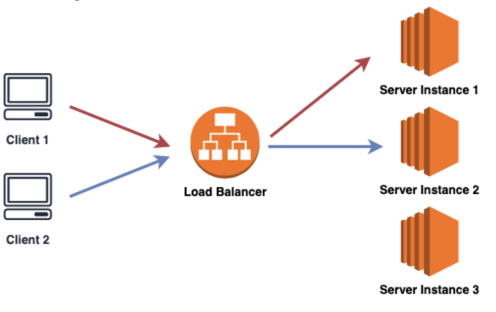
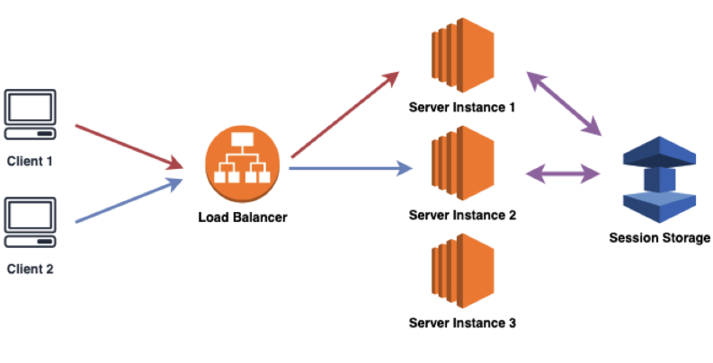
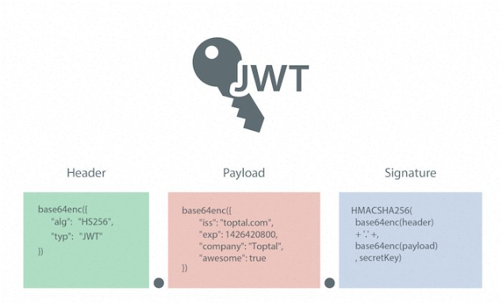

# Login (Session & Token)

  * [Session Login](#session-login)
    + [Session기반 인증 동작과정](#session----------)
    + [Session기반 인증의 특징](#session---------)
    + [Load Balancer를 사용하는 환경인 경우](#load-balancer-------------)
  * [Token Login](#token-login)
    + [JWT](#jwt)
    + [Token기반 인증 동작과정 (Assess Token + Refresh Token)](#token------------assess-token---refresh-token-)
    + [Token기반 인증의 특징](#token---------)
    + [Refresh Token](#refresh-token)
    + [Token의 저장장소](#token------)
  * [결론](#--)
  * [Reference](#reference)

## Login이란?

사용자가 컴퓨터 시스템이나 통신망에 들어가기 위해 자신의 사용자명과 패스워드를 입력하는 일

HTTP는 기본적으로 stateless 이므로 사용자가 누군지 알 수 없다. => 요청할 때마다 사용자가 누군지 알려줘야함

사용자를 식별하기 위해 사용자 정보를 매 요청에 담아 보낸다면 매우 귀찮고 보안이 매우 취약해짐 => 다른 방법 필요

## Session Login

### Session기반 인증 동작과정

- 로그인시 쿠키에 세션id를 저장하고 세션id를 사용해 인증

### Session기반 인증의 특징

- 서버에서 클라이언트의 session 정보를 메모리나 디스크 또는 DB등을 통해 저장하고 있다.
- 세션 기반 인증 방식은 클라이언트로부터 요청을 받으면, 클라이언트의 상태를 서버에서 계속 유지하고 이 정보를 서비스에 이용하는 **stateful** 서버

#### 장점

- 서버에서 클라이언트의 상태를 유지하고 있으므로, 사용자의 로그인 여부 확인이 용이
- 접속 시간에 제한을 두어 일정시간 응답이 없으면 유지되지 않게 설정할 수 있다. => 강제로그아웃 가능
- 클라이언트가 임의로 정보를 변경시키더라도 서버에서 클라이언트의 상태 정보를 가지고 있으므로 상대적으로 안전

#### 단점

- 서버에서 클라이언트의 상태를 모두 유지(**stateful**)하고 있어야 하므로, 클라이언트 수에 따른 메모리나 디스크 또는 DB에 부하가 심합니다.
- 사용자가 많아지는 경우 로드 밸런싱을 통한 서버 확장을 이용해야 하는 데 이 때 세션의 관리가 어려워집니다.

- 웹 브라우저에서 세션 관리에 사용하는 쿠키는 단일 도메인 및 서브 도메인에서만 작동하도록 설계되어 여러 도메인에 request를 보내는 경우 쿠키 및 세션 관리가 어렵다
- 멀티 디바이스 환경(모바일, 브라우저 공동 사용 등)에서 로그인 시 중복 로그인 처리가 되지 않음
- 네이티브 앱에서는 쿠키를 사용할 수 없음 => 모바일 앱의 인증을 위해서는 토큰인증 사용해야함

### Load Balancer를 사용하는 환경인 경우

- MSA환경인 경우
  - 
  - 서버 인스턴스에 세션정보를 저장하게 되는데, 서버 인스턴스에 장애가 발생하면 세션 정보가 모두 사라지게 된다.
  - 다른 서버 인스턴스에 접근할 경우 세션정보가 없다.

- Session Storage를 사용해 극복

  - 

  - 그러나 요청마다 Session Storage와 통신이 필요하고 트래픽이 몰리게 될 경우 IO 병목현상이 생기거나 SPOF가 될 수 있다.
  - IO 병목현상 : 입출력 관련 성능이 충분히 빠르지 않을 떄 발생
  - SPOF (Single Point of Failure, 단일 고장 점) : 시스템 구성요소 중에서 동작하지 않으면 전체 시스템이 중단되는 요소

## Token Login

JWT(Json Web Token) 사용하여 Stateless하게 인증

### JWT 

1. Header : 토큰의 타입이나 서명생성 알고리즘 등을 저장
2. Payload : 사용자 식별정보 등을 저장
3. Signature : Header나 Payload와 달리 client에서 임의로 복호화 할 수 없으며, 서버가 가지고 있는 개인키로만 복호화 할 수 있다.

### Token기반 인증 동작과정 (Assess Token + Refresh Token)

### Token기반 인증의 특징

#### 장점

- 세션/쿠키는 별도의 저장소의 관리가 필요하나 JWT는 발급한 후 검증만 하면 되기 때문에 추가 저장소가 필요없다. => Stateless 한 서버구축 가능
- Stateless는 어떠한 별도의 저장소도 사용하지 않는, 즉 상태를 저장하지 않는 것을 의미 =>  서버를 확장하거나 유지, 보수하는데 유리
- 세션 로그인으로는 구축이 어려운 SSO 서비스를 쉽게 구축할 수 있다(확장성). 

#### 단점

- 이미 발급된 JWT에 대해서는 돌이킬 수 없다. => JWT가 탈취될 경우 보안이슈 발생
- 토큰이 만료될때까지 계속 사용할 수 있다. => 서버측에서 강제 로그아웃 불가
- Payload는 따로 암호화되지 않기 때문에 디코딩하면 누구나 정보를 확인할 수 있다. => 유저의 중요한 정보들은 Payload에 넣을 수 없다.
- 세션/쿠키 방식에 비해 JWT의 길이가 길어, 인증이 필요한 요청이 많아질 수록 서버의 자원낭비가 발생하게 된다. => 네트워크 부하 증가

### Refresh Token

- Access Token과 더불어 Refresh Token을 사용하여 보안이슈 대비
- Access Token의 유효기간을 짧게 설정

- Refresh Token의 유효기간은 길게 설정
- 기본적으로 Access Token을 사용하여  인증, Access Token이 만료된 경우 Refresh Token을 사용하여 Access Token재발급
- 재발급 과정에서 다른나라의 IP 주소로 요청이 들어온다거나 또는 계정 도용으로 신고된 아이디인지 등을 확인하는 작업을 통해 서버에서 토큰을 검증 할 수 있다.

### Token의 저장장소

- 일반 쿠키나 브라우저 스토리지는 JS로 접근할 수 있기 때문에 보안측면에서는 권장되지 않음
- http-only 속성과 Secure속성이 부여된 쿠키에 저장하는 것을 권장
- http-only 속성과 부여된 쿠키는 JS 환경에서 접근할 수 없기 때문에 XSS나 CSRF가 발생하더라도 토큰이 누출되지 않는다.
- Secure속성 설정을 통해 HTTPS인 경우에만 쿠키를 전송하고 HTTP에서는 쿠키를 전송하지 않아야 한다.

## 결론

서비스의 규모나 원하는 보안 수준에 따라서 적당하게 골라서 사용하자!!

## Reference

> https://catsbi.oopy.io/0c27061c-204c-4fbf-acfd-418bdc855fd8

> https://chul2-ing.tistory.com/77

> https://velog.io/@tsi0521/%EB%A1%9C%EA%B7%B8%EC%9D%B8-%EB%B0%A9%EC%8B%9D%EC%97%90-%EB%8C%80%ED%95%B4-%EC%95%8C%EC%95%84%EB%B3%B4%EC%9E%90

> https://velog.io/@ssssujini99/%EC%9B%B9-Session-%EA%B8%B0%EB%B0%98-%EC%9D%B8%EC%A6%9D

> https://devs0n.tistory.com/26